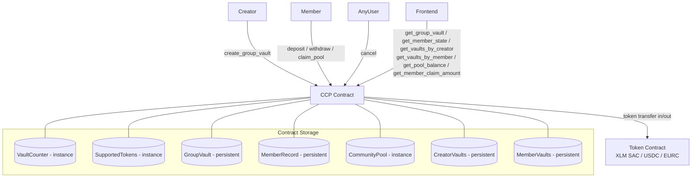

# Design Document: Collective Commitment Protocol

## Overview

The Collective Commitment Protocol (CCP) is a standalone Soroban smart contract on Stellar testnet. It implements a permissioned multi-user escrow system where a group of members collectively lock funds into a shared vault. The protocol enforces participation through a funding deadline, handles funding failures with full refunds, penalizes early exits by redistributing penalties to committed members, and resolves all funds deterministically with no value created or destroyed.

The CCP is architecturally independent of the existing time-locked-vault contract. It shares the same Soroban SDK version (22.0.0), storage patterns, and TTL extension constant (535,000 ledgers), but is a separate contract with its own deployment, storage namespace, and function surface.

### Key Design Decisions

- **Three cooperating layers** — Vault Registry (creation/membership), Vault Execution Engine (deposit/withdraw/cancel), Community Settlement Pool (penalty accumulation/distribution) are logical separations within a single contract.
- **Per-member obligation amounts** — each member has an independently configured obligation stored in a `Map<Address, i128>` inside the `GroupVault` struct.
- **Lazy state transitions** — `Settlement_Ready` is detected lazily: when `withdraw` or `claim_pool` is called, the contract checks `unlock_time` against `env.ledger().timestamp()` and transitions if needed. No cron or keeper is required.
- **Integer-only arithmetic** — penalty is `floor(amount * penalty_rate / 10_000)`, payout is `amount - penalty`, guaranteeing `payout + penalty == amount` with no remainder lost.
- **Equal pool distribution with first-claimer remainder** — `equal_share = floor(pool_balance / active_member_count)`. The remainder (`pool_balance % active_member_count`) is awarded to the first caller of `claim_pool` to ensure the pool drains to exactly zero.
- **Immutable membership** — the member list and obligation map are fixed at creation time and never modified.

---

## Architecture



All time checks use `env.ledger().timestamp()`. No external oracle dependency.

---

## Components and Interfaces

### Public Contract Functions

```rust
/// Initialize the contract once after deployment.
/// Stores supported token addresses and sets vault counter to 0.
pub fn initialize(
    env: Env,
    xlm_token: Address,
    usdc_token: Address,
    eurc_token: Address,
) -> Result<(), CcpError>;

/// Create a new group vault. Returns the new vault_id.
/// Creator does not need to be a member.
pub fn create_group_vault(
    env: Env,
    creator: Address,          // require_auth()
    token: Address,
    members: Vec<Address>,     // 5–100 addresses
    amounts: Vec<i128>,        // parallel to members; each > 0
    unlock_time: u64,          // must be > ledger timestamp
    funding_deadline: u64,     // must be > ledger timestamp and < unlock_time
    lock_type: LockType,
    penalty_rate: u32,         // 0 for Strict; 1–10000 for Penalty
) -> Result<u64, CcpError>;

/// Deposit the caller's exact obligation amount into the vault.
/// Caller must be a member in Committed state; vault must be Funding_Open.
pub fn deposit(
    env: Env,
    caller: Address,           // require_auth()
    vault_id: u64,
) -> Result<(), CcpError>;

/// Withdraw from a vault. Behaviour depends on vault state and lock type:
///   - Cancelled vault + Deposited member  → full refund
///   - Settlement_Ready vault + Active member → full obligation return
///   - Active_Locked vault + Active member + Penalty lock → early exit with penalty
///   - Active_Locked vault + Active member + Strict lock → error
pub fn withdraw(
    env: Env,
    caller: Address,           // require_auth()
    vault_id: u64,
) -> Result<(), CcpError>;

/// Cancel a vault that is Funding_Open and past its funding_deadline.
/// Any caller may invoke this.
pub fn cancel(
    env: Env,
    vault_id: u64,
) -> Result<(), CcpError>;

/// Claim the caller's equal share of the Community Settlement Pool.
/// Caller must be Active or Withdrawn; vault must be Settlement_Ready.
pub fn claim_pool(
    env: Env,
    caller: Address,           // require_auth()
    vault_id: u64,
) -> Result<(), CcpError>;

// ── Read-only queries ──────────────────────────────────────────────────────

pub fn get_group_vault(env: Env, vault_id: u64) -> Result<GroupVault, CcpError>;

pub fn get_member_state(
    env: Env,
    vault_id: u64,
    member: Address,
) -> Result<MemberRecord, CcpError>;

pub fn get_vaults_by_creator(env: Env, creator: Address) -> Vec<u64>;

pub fn get_vaults_by_member(env: Env, member: Address) -> Vec<u64>;

pub fn get_pool_balance(env: Env, vault_id: u64) -> i128;

/// Returns floor(pool_balance / active_member_count).
/// Returns 0 if pool_balance is 0 or active_member_count is 0.
pub fn get_member_claim_amount(env: Env, vault_id: u64, member: Address) -> i128;
```

### Internal Helpers

```rust
fn next_vault_id(env: &Env) -> u64;
fn is_supported_token(env: &Env, token: &Address) -> bool;
fn get_group_vault_unchecked(env: &Env, vault_id: u64) -> Option<GroupVault>;
fn save_group_vault(env: &Env, vault_id: u64, vault: &GroupVault);
fn get_member_record(env: &Env, vault_id: u64, member: &Address) -> Option<MemberRecord>;
fn save_member_record(env: &Env, vault_id: u64, member: &Address, record: &MemberRecord);
fn get_pool(env: &Env, vault_id: u64) -> i128;
fn add_to_pool(env: &Env, vault_id: u64, amount: i128);
fn set_pool(env: &Env, vault_id: u64, amount: i128);
fn get_creator_vaults(env: &Env, creator: &Address) -> Vec<u64>;
fn save_creator_vaults(env: &Env, creator: &Address, ids: &Vec<u64>);
fn get_member_vaults(env: &Env, member: &Address) -> Vec<u64>;
fn save_member_vaults(env: &Env, member: &Address, ids: &Vec<u64>);
fn token_client<'a>(env: &'a Env, token: &Address) -> token::Client<'a>;
fn calculate_penalty(amount: i128, penalty_rate: u32) -> (i128, i128);
fn count_active_members(env: &Env, vault_id: u64, vault: &GroupVault) -> u32;
fn maybe_transition_to_settlement_ready(env: &Env, vault_id: u64, vault: &mut GroupVault);
```

---

## Data Models

### Enums

```rust
#[contracttype]
#[derive(Clone, PartialEq, Debug)]
pub enum VaultState {
    FundingOpen,
    ActiveLocked,
    SettlementReady,
    Resolved,
    Cancelled,
}

#[contracttype]
#[derive(Clone, PartialEq, Debug)]
pub enum MemberState {
    Committed,
    Deposited,
    Active,
    Exited,
    Withdrawn,
    Claimed,
}

#[contracttype]
#[derive(Clone, PartialEq, Debug)]
pub enum LockType {
    Strict,
    Penalty,
}
```

> Note: Soroban `#[contracttype]` enum variants must be valid Rust identifiers. The requirements use `Active_Locked` etc.; the implementation uses `ActiveLocked`, `FundingOpen`, `SettlementReady` (camel-case) to satisfy the Rust compiler while preserving the same semantics.

### Structs

```rust
#[contracttype]
#[derive(Clone, Debug)]
pub struct GroupVault {
    pub vault_id: u64,
    pub creator: Address,
    pub token: Address,
    pub members: Vec<Address>,
    pub obligations: Map<Address, i128>,  // member → obligation amount
    pub unlock_time: u64,
    pub funding_deadline: u64,
    pub lock_type: LockType,
    pub penalty_rate: u32,               // basis points; 0 for Strict
    pub state: VaultState,
    pub total_size: i128,                // sum of all obligation amounts
    pub deposited_count: u32,            // number of members in Deposited/Active state
}

#[contracttype]
#[derive(Clone, Debug)]
pub struct MemberRecord {
    pub state: MemberState,
    pub amount: i128,   // obligation amount (set at creation; 0 for non-members)
}
```

### Event Structs

```rust
#[contracttype]
#[derive(Clone, Debug)]
pub struct GroupVaultCreatedEvent {
    pub vault_id: u64,
    pub creator: Address,
    pub token: Address,
    pub member_count: u32,
    pub total_vault_size: i128,
    pub unlock_time: u64,
    pub lock_type: LockType,
}

#[contracttype]
#[derive(Clone, Debug)]
pub struct MemberDepositedEvent {
    pub vault_id: u64,
    pub member: Address,
    pub amount: i128,
}

#[contracttype]
#[derive(Clone, Debug)]
pub struct VaultActivatedEvent {
    pub vault_id: u64,
}

#[contracttype]
#[derive(Clone, Debug)]
pub struct VaultCancelledEvent {
    pub vault_id: u64,
}

#[contracttype]
#[derive(Clone, Debug)]
pub struct MemberEarlyExitEvent {
    pub vault_id: u64,
    pub member: Address,
    pub payout: i128,
    pub penalty: i128,
}

#[contracttype]
#[derive(Clone, Debug)]
pub struct MemberWithdrawnEvent {
    pub vault_id: u64,
    pub member: Address,
    pub amount: i128,
}

#[contracttype]
#[derive(Clone, Debug)]
pub struct PoolClaimedEvent {
    pub vault_id: u64,
    pub member: Address,
    pub claimed: i128,
}

#[contracttype]
#[derive(Clone, Debug)]
pub struct VaultResolvedEvent {
    pub vault_id: u64,
}
```

### DataKey Enum

```rust
#[contracttype]
pub enum DataKey {
    // Instance storage — cheap reads, shared contract lifetime
    VaultCounter,                    // u64
    SupportedTokens,                 // Vec<Address>
    CommunityPool(u64),              // vault_id → i128

    // Persistent storage — survives ledger expiry; TTL extended on every write
    GroupVault(u64),                 // vault_id → GroupVault
    MemberRecord(u64, Address),      // (vault_id, member) → MemberRecord
    CreatorVaults(Address),          // creator → Vec<u64>
    MemberVaults(Address),           // member  → Vec<u64>
}
```

### Storage Tier Rationale

| Key | Tier | Reason |
|---|---|---|
| `VaultCounter` | Instance | Single global counter; cheap reads |
| `SupportedTokens` | Instance | Small fixed list; rarely changes |
| `CommunityPool(id)` | Instance | Frequently read during claims; per-vault scalar |
| `GroupVault(id)` | Persistent | Holds user funds; must survive ledger expiry |
| `MemberRecord(id, addr)` | Persistent | Per-member state; must survive ledger expiry |
| `CreatorVaults(addr)` | Persistent | User index; must survive ledger expiry |
| `MemberVaults(addr)` | Persistent | User index; must survive ledger expiry |

All persistent entries are extended to `LEDGER_BUMP_AMOUNT = 535_000` ledgers on every write.

---

## Storage Helpers

```rust
// src/storage.rs

use soroban_sdk::{Address, Env, Map, Vec};
use crate::{DataKey, GroupVault, MemberRecord};

pub const LEDGER_BUMP_AMOUNT: u32 = 535_000;

pub fn next_vault_id(env: &Env) -> u64 {
    let counter: u64 = env.storage().instance().get(&DataKey::VaultCounter).unwrap_or(0);
    env.storage().instance().set(&DataKey::VaultCounter, &(counter + 1));
    counter
}

pub fn is_supported_token(env: &Env, token: &Address) -> bool {
    let tokens: Vec<Address> = match env.storage().instance().get(&DataKey::SupportedTokens) {
        Some(t) => t,
        None => return false,
    };
    tokens.contains(token)
}

pub fn get_group_vault_unchecked(env: &Env, vault_id: u64) -> Option<GroupVault> {
    env.storage().persistent().get(&DataKey::GroupVault(vault_id))
}

pub fn save_group_vault(env: &Env, vault_id: u64, vault: &GroupVault) {
    let key = DataKey::GroupVault(vault_id);
    env.storage().persistent().set(&key, vault);
    env.storage().persistent().extend_ttl(&key, LEDGER_BUMP_AMOUNT, LEDGER_BUMP_AMOUNT);
}

pub fn get_member_record(env: &Env, vault_id: u64, member: &Address) -> Option<MemberRecord> {
    env.storage().persistent().get(&DataKey::MemberRecord(vault_id, member.clone()))
}

pub fn save_member_record(env: &Env, vault_id: u64, member: &Address, record: &MemberRecord) {
    let key = DataKey::MemberRecord(vault_id, member.clone());
    env.storage().persistent().set(&key, record);
    env.storage().persistent().extend_ttl(&key, LEDGER_BUMP_AMOUNT, LEDGER_BUMP_AMOUNT);
}

pub fn get_pool(env: &Env, vault_id: u64) -> i128 {
    env.storage().instance().get(&DataKey::CommunityPool(vault_id)).unwrap_or(0)
}

pub fn add_to_pool(env: &Env, vault_id: u64, amount: i128) {
    let current = get_pool(env, vault_id);
    env.storage().instance().set(&DataKey::CommunityPool(vault_id), &(current + amount));
}

pub fn set_pool(env: &Env, vault_id: u64, amount: i128) {
    env.storage().instance().set(&DataKey::CommunityPool(vault_id), &amount);
}

pub fn get_creator_vaults(env: &Env, creator: &Address) -> Vec<u64> {
    let key = DataKey::CreatorVaults(creator.clone());
    env.storage().persistent().get(&key).unwrap_or_else(|| Vec::new(env))
}

pub fn save_creator_vaults(env: &Env, creator: &Address, ids: &Vec<u64>) {
    let key = DataKey::CreatorVaults(creator.clone());
    env.storage().persistent().set(&key, ids);
    env.storage().persistent().extend_ttl(&key, LEDGER_BUMP_AMOUNT, LEDGER_BUMP_AMOUNT);
}

pub fn get_member_vaults(env: &Env, member: &Address) -> Vec<u64> {
    let key = DataKey::MemberVaults(member.clone());
    env.storage().persistent().get(&key).unwrap_or_else(|| Vec::new(env))
}

pub fn save_member_vaults(env: &Env, member: &Address, ids: &Vec<u64>) {
    let key = DataKey::MemberVaults(member.clone());
    env.storage().persistent().set(&key, ids);
    env.storage().persistent().extend_ttl(&key, LEDGER_BUMP_AMOUNT, LEDGER_BUMP_AMOUNT);
}
```

---

## Error Types

```rust
#[contracterror]
#[derive(Copy, Clone, Debug, PartialEq)]
pub enum CcpError {
    // Initialization
    AlreadyInitialized      = 1,
    NotInitialized          = 2,

    // Input validation
    InvalidMemberCount      = 10,  // < 5 or > 100
    MemberAmountMismatch    = 11,  // members.len() != amounts.len()
    InvalidObligationAmount = 12,  // any amount <= 0
    UnsupportedToken        = 13,
    InvalidUnlockTime       = 14,  // unlock_time <= ledger timestamp
    InvalidFundingDeadline  = 15,  // deadline <= timestamp or deadline >= unlock_time
    InvalidPenaltyRate      = 16,  // Penalty vault with rate 0 or > 10000

    // Vault lifecycle
    VaultNotFound           = 20,
    NotMember               = 21,
    WrongVaultState         = 22,  // operation not valid in current vault state
    WrongMemberState        = 23,  // operation not valid in current member state
    FundingDeadlinePassed   = 24,  // deposit after deadline
    FundingDeadlineNotPassed = 25, // cancel before deadline
    EarlyExitNotAllowed     = 26,  // Strict vault, before unlock_time

    // Access control
    Unauthorized            = 30,

    // Token transfer
    TransferFailed          = 40,
}
```

---

## Penalty Calculation Logic

```rust
/// Returns (payout, penalty).
/// penalty = floor(amount * penalty_rate / 10_000)
/// payout  = amount - penalty
/// Invariant: payout + penalty == amount  (integer floor, no remainder lost)
pub fn calculate_penalty(amount: i128, penalty_rate: u32) -> (i128, i128) {
    let penalty = amount * (penalty_rate as i128) / 10_000;
    let payout = amount - penalty;
    (payout, penalty)
}
```

Because `penalty = floor(amount * rate / 10_000)` and `payout = amount - penalty`, the identity `payout + penalty == amount` holds exactly. Any fractional basis-point remainder stays with the user in `payout`.

---

## Pool Distribution Logic

```rust
/// Returns the equal share for one active member.
/// equal_share = floor(pool_balance / active_member_count)
/// The remainder (pool_balance % active_member_count) goes to the first claimer.
pub fn compute_claim_amount(pool_balance: i128, active_count: u32, is_first_claimer: bool) -> i128 {
    if active_count == 0 || pool_balance == 0 {
        return 0;
    }
    let base = pool_balance / (active_count as i128);
    let remainder = pool_balance % (active_count as i128);
    if is_first_claimer { base + remainder } else { base }
}
```

The "first claimer" is determined by checking whether the pool balance at claim time equals the full original pool (i.e., no one has claimed yet). This is tracked by comparing `get_pool(vault_id)` before deduction: if it equals the stored original pool total, this is the first claim.

A simpler and more robust approach: track `claimed_count` in the `GroupVault` struct. When `claimed_count == 0`, the caller is the first claimer and receives `base + remainder`. Subsequent claimers receive `base`. The pool is decremented by the actual amount transferred on each claim.

---

## State Transition Logic

### Vault State Machine

```
FundingOpen ──(all members deposited)──► ActiveLocked
FundingOpen ──(deadline passed, cancel called)──► Cancelled

ActiveLocked ──(unlock_time reached, lazy on next op)──► SettlementReady

SettlementReady ──(all Active/Withdrawn members claimed)──► Resolved
```

Terminal states: `Resolved`, `Cancelled` — no transitions out.

**Lazy `SettlementReady` transition**: At the start of `withdraw` and `claim_pool`, the contract checks:
```rust
fn maybe_transition_to_settlement_ready(env: &Env, vault_id: u64, vault: &mut GroupVault) {
    if vault.state == VaultState::ActiveLocked
        && env.ledger().timestamp() >= vault.unlock_time
    {
        vault.state = VaultState::SettlementReady;
        save_group_vault(env, vault_id, vault);
    }
}
```

**`Deposited` → `Active` transition**: When a vault transitions from `FundingOpen` to `ActiveLocked` (on the final deposit), all members in `Deposited` state are transitioned to `Active`. This is done in a loop over `vault.members` at the moment of full funding.

### Member State Machine

```
Committed ──(deposit)──► Deposited
Deposited ──(vault fully funded)──► Active
Active ──(mature withdraw on SettlementReady)──► Withdrawn
Active ──(early exit on ActiveLocked Penalty vault)──► Exited
Withdrawn ──(claim_pool)──► Claimed
Active ──(claim_pool, skipped withdraw)──► Claimed
```

Terminal states per vault: `Exited`, `Withdrawn` (if no pool claim needed), `Claimed`.

**`Exited` is irreversible**: No deposit, withdraw, or claim_pool is permitted from `Exited` state.

**`claim_pool` eligibility**: Members in `Active` or `Withdrawn` state may call `claim_pool`. This allows members to claim their pool share without having first called `withdraw` (or after having called it).

---

## Event Emission Structure

Events use `symbol_short!` topics (≤ 9 characters) and typed data structs.

```rust
// group vault created
env.events().publish(
    (symbol_short!("grp_crt"), vault_id),
    GroupVaultCreatedEvent { vault_id, creator, token, member_count, total_vault_size, unlock_time, lock_type },
);

// member deposited
env.events().publish(
    (symbol_short!("mem_dep"), vault_id),
    MemberDepositedEvent { vault_id, member, amount },
);

// vault activated (fully funded → ActiveLocked)
env.events().publish(
    (symbol_short!("vlt_act"), vault_id),
    VaultActivatedEvent { vault_id },
);

// vault cancelled
env.events().publish(
    (symbol_short!("vlt_can"), vault_id),
    VaultCancelledEvent { vault_id },
);

// member early exit
env.events().publish(
    (symbol_short!("mem_exit"), vault_id),
    MemberEarlyExitEvent { vault_id, member, payout, penalty },
);

// member mature withdrawal
env.events().publish(
    (symbol_short!("mem_wdr"), vault_id),
    MemberWithdrawnEvent { vault_id, member, amount },
);

// pool claimed
env.events().publish(
    (symbol_short!("pool_clm"), vault_id),
    PoolClaimedEvent { vault_id, member, claimed },
);

// vault resolved
env.events().publish(
    (symbol_short!("vlt_res"), vault_id),
    VaultResolvedEvent { vault_id },
);
```

All `symbol_short!` strings are ≤ 9 characters.

---

## Access Control Model

| Operation | Auth Required | Additional Check |
|---|---|---|
| `initialize` | None | One-time init guard (error if already initialized) |
| `create_group_vault` | `creator.require_auth()` | None beyond auth |
| `deposit` | `caller.require_auth()` | Caller must be in vault's member list |
| `withdraw` | `caller.require_auth()` | Caller must be in vault's member list; state checks |
| `cancel` | None | Vault must be FundingOpen and past deadline |
| `claim_pool` | `caller.require_auth()` | Caller must be in vault's member list; state checks |
| All `get_*` | None | Read-only |

The creator has no special privileges after vault creation. They cannot modify membership, obligations, or vault parameters. The creator may also be a member if their address appears in the `members` list.

---


## Correctness Properties

*A property is a characteristic or behavior that should hold true across all valid executions of a system — essentially, a formal statement about what the system should do. Properties serve as the bridge between human-readable specifications and machine-verifiable correctness guarantees.*

### Property 1: Vault Creation Round-Trip

*For any* valid combination of supported token, member list (5–100 addresses), positive obligation amounts, future `unlock_time`, future `funding_deadline` (< `unlock_time`), `lock_type`, and valid `penalty_rate`, calling `create_group_vault` and then `get_group_vault` with the returned `vault_id` SHALL return a `GroupVault` whose `creator`, `token`, `members`, `obligations`, `unlock_time`, `funding_deadline`, `lock_type`, `penalty_rate`, `state` (FundingOpen), and `total_size` exactly match the inputs, and every member's `MemberRecord` SHALL have state `Committed` and the correct obligation amount.

**Validates: Requirements 1.1, 1.12, 1.13, 1.17, 12.3**

### Property 2: Invalid Creation Inputs Rejected

*For any* call to `create_group_vault` where any of the following holds — member count outside [5, 100], amounts list length ≠ members list length, any obligation amount ≤ 0, unsupported token, `unlock_time` ≤ ledger timestamp, `funding_deadline` ≤ ledger timestamp, `funding_deadline` ≥ `unlock_time`, or `lock_type` is Penalty with `penalty_rate` outside [1, 10000] — the contract SHALL return an error and no vault record SHALL be created.

**Validates: Requirements 1.2, 1.3, 1.4, 1.5, 1.6, 1.7, 1.8, 1.9, 1.10, 1.11**

### Property 3: Creator and Member Index Completeness

*For any* sequence of `create_group_vault` calls, `get_vaults_by_creator` SHALL return a list containing every `vault_id` created by that creator, and for every member in every created vault, `get_vaults_by_member` SHALL return a list containing that `vault_id` — with no omissions.

**Validates: Requirements 1.15, 1.16, 11.5, 11.6**

### Property 4: Deposit Transitions Member State and Triggers Activation

*For any* vault in `FundingOpen` state and any member in `Committed` state, a successful `deposit` SHALL transfer exactly the member's obligation amount from the member to the contract, transition the member's state to `Deposited`, and — when this is the final deposit causing all members to be `Deposited` — transition the vault state to `ActiveLocked` and all members to `Active`.

**Validates: Requirements 2.1, 2.6, 2.7, 8.1**

### Property 5: Non-Member and Wrong-State Deposit Rejected

*For any* vault and any address not in the vault's member list, `deposit` SHALL return an error. *For any* member whose state is not `Committed` (already deposited, exited, etc.), `deposit` SHALL return an error and no transfer SHALL occur.

**Validates: Requirements 2.2, 2.3, 2.4, 8.4**

### Property 6: Cancellation and Full Refund Conservation

*For any* vault in `FundingOpen` state past its `funding_deadline`, `cancel` SHALL transition the vault to `Cancelled`. Subsequently, *for any* member in `Deposited` state on that cancelled vault, `withdraw` SHALL return exactly the member's obligation amount. The sum of all refunds SHALL equal the sum of all deposited obligation amounts — no value is created or destroyed.

**Validates: Requirements 3.1, 3.5, 3.6, 3.8, 9.2, 9.5**

### Property 7: Penalty Arithmetic Invariant

*For any* Penalty vault with a member obligation amount `A` and `penalty_rate` `R` in [1, 10000], when a member in `Active` state calls `withdraw` on an `ActiveLocked` vault, the penalty SHALL equal `floor(A * R / 10_000)`, the payout SHALL equal `A - penalty`, and `payout + penalty` SHALL equal `A` exactly — no value is lost or created.

**Validates: Requirements 5.1, 5.2, 9.2**

### Property 8: Strict Vault Blocks Early Exit

*For any* Strict vault in `ActiveLocked` state, calling `withdraw` by any member in `Active` state SHALL return `EarlyExitNotAllowed` and the member's state SHALL remain `Active`.

**Validates: Requirements 4.3, 5.3**

### Property 9: Pool Accumulation and Equal Distribution Conservation

*For any* vault where N members exit early with penalties `p_1, …, p_N`, the pool balance SHALL equal `sum(p_i)`. When the vault reaches `SettlementReady` with `K` active members, each member's claim amount SHALL equal `floor(pool_balance / K)`, the first claimer SHALL receive `floor(pool_balance / K) + (pool_balance % K)`, and the sum of all claimed amounts SHALL equal `pool_balance` exactly — no value is created or destroyed.

**Validates: Requirements 6.1, 6.2, 6.6, 9.3, 9.4**

### Property 10: Mature Withdrawal Returns Full Obligation Amount

*For any* vault in `SettlementReady` state and any member in `Active` state, calling `withdraw` SHALL transfer exactly the member's obligation amount back to the member and transition the member's state to `Withdrawn`.

**Validates: Requirements 4.1, 4.5**

### Property 11: Double-Action Prevention (Idempotence Guard)

*For any* member and vault, calling `deposit` twice, `withdraw` twice, or `claim_pool` twice SHALL result in the second call returning an error — the member's state and token balances SHALL remain unchanged after the second call.

**Validates: Requirements 8.4, 8.5, 8.6**

### Property 12: Terminal State Irreversibility

*For any* vault that has reached `Resolved` or `Cancelled`, no state-mutating operation (`deposit`, `withdraw`, `cancel`, `claim_pool`) SHALL succeed — all SHALL return an error and the vault state SHALL remain in its terminal state.

**Validates: Requirements 7.3, 7.5**

---

## Error Handling

| Scenario | Error | State Change |
|---|---|---|
| `initialize` called twice | `AlreadyInitialized` | None |
| `create_group_vault` with member count < 5 or > 100 | `InvalidMemberCount` | None |
| `create_group_vault` with amounts.len() ≠ members.len() | `MemberAmountMismatch` | None |
| `create_group_vault` with any amount ≤ 0 | `InvalidObligationAmount` | None |
| `create_group_vault` with unsupported token | `UnsupportedToken` | None |
| `create_group_vault` with unlock_time ≤ now | `InvalidUnlockTime` | None |
| `create_group_vault` with deadline ≤ now or deadline ≥ unlock_time | `InvalidFundingDeadline` | None |
| `create_group_vault` Penalty vault with rate 0 or > 10000 | `InvalidPenaltyRate` | None |
| `deposit` / `withdraw` / `claim_pool` by non-member | `NotMember` | None |
| `deposit` when vault state ≠ FundingOpen | `WrongVaultState` | None |
| `deposit` after funding_deadline | `FundingDeadlinePassed` | None |
| `deposit` by member with state ≠ Committed | `WrongMemberState` | None |
| `withdraw` on Cancelled vault by member with state ≠ Deposited | `WrongMemberState` | None |
| `withdraw` on SettlementReady vault by member with state ≠ Active | `WrongMemberState` | None |
| `withdraw` on ActiveLocked Strict vault | `EarlyExitNotAllowed` | None |
| `withdraw` on vault in FundingOpen or Resolved state | `WrongVaultState` | None |
| `cancel` when vault state ≠ FundingOpen | `WrongVaultState` | None |
| `cancel` before funding_deadline | `FundingDeadlineNotPassed` | None |
| `claim_pool` when vault state ≠ SettlementReady | `WrongVaultState` | None |
| `claim_pool` by member with state ≠ Active or Withdrawn | `WrongMemberState` | None |
| `get_group_vault` with unknown vault_id | `VaultNotFound` | None |
| `get_member_state` with non-member address | `NotMember` | None |
| Token transfer failure | `TransferFailed` | State unchanged |

All errors are returned as `Result<_, CcpError>`. `require_auth()` failures surface as host-level panics before contract code runs.

---

## Testing Strategy

### Unit Tests (example-based)

Concrete scenarios and edge cases:

- `initialize` happy path; second call returns `AlreadyInitialized`
- `create_group_vault` happy path for each of the three supported tokens
- `create_group_vault` with each invalid input variant (member count 4, 101, mismatched lengths, zero amount, unsupported token, past unlock_time, past deadline, deadline ≥ unlock_time, Penalty rate 0, Penalty rate 10001)
- Full deposit flow: all members deposit → vault transitions to `ActiveLocked`
- Partial deposit flow: deadline passes → `cancel` → each depositor withdraws full amount
- Mature withdrawal: all deposit → advance past unlock_time → each member withdraws full amount
- Early exit (Penalty): member exits early → verify exact payout and penalty → pool balance updated
- Early exit (Strict): returns `EarlyExitNotAllowed`
- Pool claim: some members exit early → remaining members reach maturity → each claims equal share → vault resolves
- Pool claim with zero pool: no early exits → claim_pool succeeds with zero transfer
- First-claimer receives remainder: pool_balance not divisible by active_count
- Double deposit returns `WrongMemberState`
- Double withdraw returns `WrongMemberState`
- Double claim_pool returns `WrongMemberState`
- Non-member deposit returns `NotMember`
- `get_group_vault` on unknown id returns `VaultNotFound`
- `get_member_state` on non-member returns `NotMember`
- `get_vaults_by_creator` / `get_vaults_by_member` return empty Vec when no vaults exist
- Event field verification for all 8 event types

### Property-Based Tests

Use [proptest](https://github.com/proptest-rs/proptest) with a minimum of 100 iterations per property.

Each test is tagged with a comment:
`// Feature: collective-commitment-protocol, Property N: <property_text>`

| Property | Generator Strategy | Assertion |
|---|---|---|
| P1: Vault creation round-trip | members ∈ [5,100], amounts ∈ [1, 10^15], valid times, lock_type, rate ∈ [1,10000] | get_group_vault fields match; all members in Committed state |
| P2: Invalid inputs rejected | member count ∈ {0..4, 101..200}, mismatched lengths, amounts with ≤0, bad token, past times, deadline ≥ unlock_time, bad rate | Returns appropriate CcpError; no vault created |
| P3: Creator and member index completeness | N ∈ [1,10] vaults for same creator, varying member lists | get_vaults_by_creator contains all vault_ids; each member's get_vaults_by_member contains vault_id |
| P4: Deposit transitions and activation | Vault with M members, deposit all M | Final deposit triggers ActiveLocked; all members in Active state |
| P5: Non-member and wrong-state deposit rejected | Random address not in member list; member who already deposited | Returns NotMember or WrongMemberState |
| P6: Cancellation and refund conservation | Partial funding (1..M-1 members deposit), advance past deadline, cancel, all depositors withdraw | Sum of refunds == sum of deposited amounts |
| P7: Penalty arithmetic invariant | amount ∈ [1, 10^18], penalty_rate ∈ [1, 10000] | penalty == floor(amount * rate / 10_000); payout + penalty == amount |
| P8: Strict vault blocks early exit | Strict vault, fully funded, ledger time < unlock_time | withdraw returns EarlyExitNotAllowed; member state unchanged |
| P9: Pool accumulation and distribution conservation | K ∈ [1, M-1] members exit early with random amounts/rates, remaining M-K reach maturity | pool == sum(penalties); sum(claims) == pool; vault resolves |
| P10: Mature withdrawal returns full amount | Any fully-funded vault, advance past unlock_time | Each active member receives exactly their obligation amount |
| P11: Double-action prevention | Any vault, attempt deposit/withdraw/claim_pool twice | Second call returns WrongMemberState |
| P12: Terminal state irreversibility | Vault in Resolved or Cancelled state | All mutating operations return WrongVaultState or WrongMemberState |

### Test Configuration

```toml
# Cargo.toml [dev-dependencies]
proptest = "1"
soroban-sdk = { version = "22.0.0", features = ["testutils"] }
```

Property tests run with `PROPTEST_CASES=100` (default); increase to 500 for CI thoroughness.

### Integration Tests (testnet)

- Full lifecycle: create → all deposit → advance time → all withdraw → all claim_pool → vault resolves
- Funding failure: partial deposit → advance past deadline → cancel → all depositors refunded
- Early exit flow: some members exit → remaining reach maturity → withdraw + claim_pool
- Query verification: `get_group_vault`, `get_member_state`, `get_vaults_by_creator`, `get_vaults_by_member`, `get_pool_balance`, `get_member_claim_amount`
- Event indexing: verify all 8 event types appear in transaction metadata
