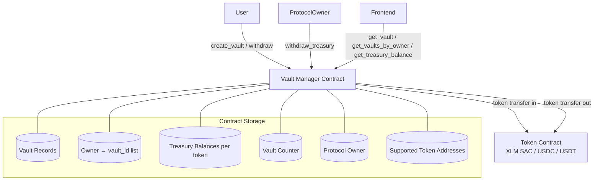

# Design Document: Time-Locked Vault

## Overview

The Time-Locked Vault is a single Soroban smart contract deployed on Stellar testnet that manages an arbitrary number of user vaults. Each vault locks a supported asset (native XLM, USDC, or USDT) for a user-defined duration. Withdrawals are governed by the vault's lock type: STRICT vaults block early exit entirely; PENALTY vaults allow early exit with a basis-point penalty forwarded to an internal treasury. A designated Protocol Owner may drain the treasury at any time.

The contract is designed to back a dApp frontend that reads vault state via `get_vault` / `get_vaults_by_owner` and reacts to on-chain events for indexing.

### Key Design Decisions

- **One contract, many vaults** — a monotonically incrementing `vault_id` counter (u64) uniquely identifies every vault across the lifetime of the contract.
- **Integer-only arithmetic** — penalty is `floor(amount * penalty_rate / 10000)`, payout is `amount - penalty`, guaranteeing `payout + penalty == amount` with no remainder lost.
- **Native XLM via Soroban token interface** — XLM is accessed through the Stellar Asset Contract (SAC) at the well-known native token address, keeping the transfer path uniform across all three assets.
- **Per-token treasury ledger** — treasury balances are tracked per token address so that `withdraw_treasury` can be called independently for each asset.

---

## Architecture



The contract has no external oracle dependency. All time checks use `env.ledger().timestamp()`.

---

## Components and Interfaces

### Public Contract Functions

```rust
/// Initialise the contract. Must be called once after deployment.
/// Stores protocol_owner, supported token addresses, and sets vault counter to 0.
pub fn initialize(
    env: Env,
    protocol_owner: Address,
    xlm_token: Address,
    usdc_token: Address,
    usdt_token: Address,
) -> Result<(), VaultError>;

/// Create a new vault. Transfers `amount` of `token` from `caller` to the contract.
/// Returns the new vault_id.
pub fn create_vault(
    env: Env,
    caller: Address,          // must call require_auth()
    token: Address,
    amount: i128,
    unlock_time: u64,
    lock_type: LockType,
    penalty_rate: u32,        // 0 for STRICT; 1–10000 for PENALTY
) -> Result<u64, VaultError>;

/// Withdraw from a vault. Behaviour depends on lock type and current time.
pub fn withdraw(
    env: Env,
    caller: Address,          // must call require_auth()
    vault_id: u64,
) -> Result<(), VaultError>;

/// Return the full Vault record for a given vault_id.
pub fn get_vault(
    env: Env,
    vault_id: u64,
) -> Result<Vault, VaultError>;

/// Return all vault_ids owned by `owner`. Returns empty Vec if none.
pub fn get_vaults_by_owner(
    env: Env,
    owner: Address,
) -> Vec<u64>;

/// Protocol Owner only. Transfer full treasury balance for `token` to protocol_owner.
pub fn withdraw_treasury(
    env: Env,
    caller: Address,          // must call require_auth(); must equal stored protocol_owner
    token: Address,
) -> Result<(), VaultError>;

/// Return the current treasury balance for `token`.
pub fn get_treasury_balance(
    env: Env,
    token: Address,
) -> i128;
```

### Internal Helpers

```rust
fn get_vault_unchecked(env: &Env, vault_id: u64) -> Option<Vault>;
fn save_vault(env: &Env, vault_id: u64, vault: &Vault);
fn next_vault_id(env: &Env) -> u64;           // reads, increments, stores counter
fn is_supported_token(env: &Env, token: &Address) -> bool;
fn add_to_treasury(env: &Env, token: &Address, amount: i128);
fn get_treasury(env: &Env, token: &Address) -> i128;
fn set_treasury(env: &Env, token: &Address, amount: i128);
fn token_client(env: &Env, token: &Address) -> token::Client;
fn protocol_owner(env: &Env) -> Address;
```

---

## Data Models

### Enums

```rust
#[contracttype]
#[derive(Clone, PartialEq, Debug)]
pub enum LockType {
    Strict,
    Penalty,
}

#[contracttype]
#[derive(Clone, PartialEq, Debug)]
pub enum VaultState {
    Active,
    Withdrawn,
}
```

### Vault Struct

```rust
#[contracttype]
#[derive(Clone, Debug)]
pub struct Vault {
    pub owner: Address,
    pub token: Address,
    pub amount: i128,
    pub start_time: u64,
    pub unlock_time: u64,
    pub lock_type: LockType,
    pub penalty_rate: u32,   // basis points; 0 for Strict vaults
    pub state: VaultState,
}
```

### Storage Keys

```rust
#[contracttype]
pub enum DataKey {
    // Instance storage
    ProtocolOwner,
    VaultCounter,
    SupportedTokens,          // Vec<Address>

    // Per-vault (persistent storage)
    Vault(u64),               // key: vault_id → Vault

    // Per-owner index (persistent storage)
    OwnerVaults(Address),     // key: owner → Vec<u64>

    // Per-token treasury (instance storage)
    Treasury(Address),        // key: token address → i128
}
```

### Storage Tier Rationale

| Key | Tier | Reason |
|---|---|---|
| `ProtocolOwner` | Instance | Rarely changes; cheap reads |
| `VaultCounter` | Instance | Single global counter |
| `SupportedTokens` | Instance | Small fixed list |
| `Vault(id)` | Persistent | Must survive ledger expiry; user funds |
| `OwnerVaults(addr)` | Persistent | Must survive ledger expiry; user index |
| `Treasury(token)` | Instance | Frequently read; protocol-level balance |

> Persistent entries must have their TTL extended on every write (via `env.storage().persistent().extend_ttl()`). The recommended ledger TTL extension is `LEDGER_BUMP_AMOUNT` (e.g. 535,000 ledgers ≈ 30 days on testnet).

---

## Token Interaction Layer

All three supported assets are accessed through the same `soroban_sdk::token::Client` interface:

```rust
use soroban_sdk::token;

fn token_client<'a>(env: &'a Env, token: &Address) -> token::Client<'a> {
    token::Client::new(env, token)
}
```

**Native XLM** is accessed via the Stellar Asset Contract (SAC). On testnet the native SAC address is obtained at deploy time and stored as `xlm_token` during `initialize`. The SAC exposes the same `transfer` / `balance` interface as any SEP-41 token contract.

**Transfer in (deposit)**:
```rust
token_client(env, &vault.token)
    .transfer(&caller, &env.current_contract_address(), &amount);
```

**Transfer out (withdrawal)**:
```rust
token_client(env, &vault.token)
    .transfer(&env.current_contract_address(), &vault.owner, &payout);
```

The contract never holds a token allowance on behalf of users beyond the single `transfer` call inside `create_vault`. The caller must have set an allowance before invoking `create_vault`.

---

## Penalty Calculation Logic

```
penalty = floor(amount * penalty_rate / 10000)
payout  = amount - penalty
```

Implemented in integer arithmetic (i128):

```rust
fn calculate_penalty(amount: i128, penalty_rate: u32) -> (i128, i128) {
    let penalty = amount * (penalty_rate as i128) / 10_000;
    let payout = amount - penalty;
    // Invariant: payout + penalty == amount  (integer division floors, no remainder lost)
    (payout, penalty)
}
```

Because `penalty = floor(amount * rate / 10000)` and `payout = amount - penalty`, the identity `payout + penalty == amount` holds exactly — any fractional basis-point remainder stays with the user (in `payout`), never disappears.

---

## Access Control Model

| Operation | Authorisation Required |
|---|---|
| `create_vault` | `caller.require_auth()` — caller pays and owns the vault |
| `withdraw` | `caller.require_auth()` — caller must equal `vault.owner` |
| `withdraw_treasury` | `caller.require_auth()` — caller must equal stored `protocol_owner` |
| `get_vault` | None — read-only |
| `get_vaults_by_owner` | None — read-only |
| `get_treasury_balance` | None — read-only |
| `initialize` | None at the Soroban level — protected by one-time init guard (error if already initialised) |

The `protocol_owner` check in `withdraw_treasury` is explicit:

```rust
let stored_owner = protocol_owner(&env);
if caller != stored_owner {
    return Err(VaultError::Unauthorized);
}
```

---

## Error Types

```rust
#[contracterror]
#[derive(Copy, Clone, Debug, PartialEq)]
pub enum VaultError {
    // Initialisation
    AlreadyInitialized    = 1,
    NotInitialized        = 2,

    // Input validation
    InvalidAmount         = 10,   // amount <= 0
    InvalidUnlockTime     = 11,   // unlock_time <= ledger timestamp
    UnsupportedToken      = 12,   // token not in supported list
    InvalidPenaltyRate    = 13,   // PENALTY vault with rate 0 or > 10000

    // Vault lifecycle
    VaultNotFound         = 20,
    AlreadyWithdrawn      = 21,
    EarlyExitNotAllowed   = 22,   // STRICT vault, before unlock_time

    // Access control
    Unauthorized          = 30,

    // Treasury
    TreasuryEmpty         = 40,

    // Token transfer (propagated from token contract panic / error)
    TransferFailed        = 50,
}
```

---

## Event Emission Structure

Events are emitted via `env.events().publish`. The first tuple element is the topic list; the second is the data payload.

```rust
// vault_created
env.events().publish(
    (symbol_short!("vault_crt"), vault_id),
    VaultCreatedEvent { vault_id, owner, token, amount, unlock_time, lock_type },
);

// withdrawn (mature)
env.events().publish(
    (symbol_short!("withdrawn"), vault_id),
    WithdrawnEvent { vault_id, owner, token, amount },
);

// early_withdrawn
env.events().publish(
    (symbol_short!("early_wdr"), vault_id),
    EarlyWithdrawnEvent { vault_id, owner, token, amount, penalty },
);

// treasury_withdrawn
env.events().publish(
    (symbol_short!("treas_wdr"), token.clone()),
    TreasuryWithdrawnEvent { token, amount },
);
```

Event structs:

```rust
#[contracttype] pub struct VaultCreatedEvent {
    pub vault_id: u64, pub owner: Address, pub token: Address,
    pub amount: i128, pub unlock_time: u64, pub lock_type: LockType,
}
#[contracttype] pub struct WithdrawnEvent {
    pub vault_id: u64, pub owner: Address, pub token: Address, pub amount: i128,
}
#[contracttype] pub struct EarlyWithdrawnEvent {
    pub vault_id: u64, pub owner: Address, pub token: Address,
    pub amount: i128, pub penalty: i128,
}
#[contracttype] pub struct TreasuryWithdrawnEvent {
    pub token: Address, pub amount: i128,
}
```

> Soroban `symbol_short!` is limited to 9 characters. All topic symbols above fit within that limit.

---

## Correctness Properties

*A property is a characteristic or behavior that should hold true across all valid executions of a system — essentially, a formal statement about what the system should do. Properties serve as the bridge between human-readable specifications and machine-verifiable correctness guarantees.*


### Property 1: Vault Creation Round-Trip

*For any* valid combination of supported token, positive amount, future unlock_time, lock_type, and valid penalty_rate, calling `create_vault` and then `get_vault` with the returned vault_id SHALL return a Vault record whose `owner`, `token`, `amount`, `unlock_time`, `lock_type`, `penalty_rate`, and `state` (Active) exactly match the inputs.

**Validates: Requirements 1.1, 1.2, 1.7, 1.8, 1.9, 5.1**

### Property 2: Invalid Inputs Rejected

*For any* call to `create_vault` where `amount <= 0`, or `unlock_time <= ledger_timestamp`, or `token` is not in the supported set, or `lock_type` is PENALTY with `penalty_rate` outside [1, 10000], the contract SHALL return an error and no vault record SHALL be created.

**Validates: Requirements 1.4, 1.5, 1.6, 1.7**

### Property 3: Owner Index Completeness

*For any* sequence of `create_vault` calls by the same owner, `get_vaults_by_owner` SHALL return a list that contains every vault_id returned by those calls, with no omissions.

**Validates: Requirements 1.10, 5.3**

### Property 4: Mature Withdrawal Returns Full Amount

*For any* vault with any positive amount and any supported token, when `withdraw` is called at or after `unlock_time`, the owner's token balance SHALL increase by exactly `amount` and the vault state SHALL become WITHDRAWN.

**Validates: Requirements 2.1, 2.2, 7.1, 7.2**

### Property 5: Unauthorized Withdrawal Rejected

*For any* vault and any caller address that does not equal the vault's owner, calling `withdraw` SHALL return an Unauthorized error and the vault state SHALL remain unchanged.

**Validates: Requirements 2.3, 3.4**

### Property 6: Double Withdrawal Rejected

*For any* vault that has already been withdrawn (state == WITHDRAWN), any subsequent call to `withdraw` SHALL return an AlreadyWithdrawn error, regardless of lock type or current ledger time.

**Validates: Requirements 2.4, 3.5, 4.2**

### Property 7: Penalty Arithmetic Invariant

*For any* PENALTY vault with amount `A` and penalty_rate `R` in [1, 10000], when `withdraw` is called before `unlock_time`, the penalty SHALL equal `floor(A * R / 10000)`, the payout SHALL equal `A - penalty`, and `payout + penalty SHALL equal A` exactly — no value is lost.

**Validates: Requirements 3.1, 3.2, 3.6**

### Property 8: STRICT Vault Blocks Early Exit

*For any* STRICT vault, calling `withdraw` at any ledger time strictly less than `unlock_time` SHALL return an EarlyExitNotAllowed error and the vault state SHALL remain Active.

**Validates: Requirements 4.1**

### Property 9: Treasury Accumulation and Drain Round-Trip

*For any* sequence of early withdrawals on PENALTY vaults for a given token, the sum of all penalties deducted SHALL equal the treasury balance reported by `get_treasury_balance`. After `withdraw_treasury` succeeds, the treasury balance for that token SHALL be zero and the protocol_owner's token balance SHALL have increased by exactly the previously accumulated amount.

**Validates: Requirements 6.1, 6.2, 6.5**

### Property 10: Unauthorized Treasury Withdrawal Rejected

*For any* caller address that does not equal the stored `protocol_owner`, calling `withdraw_treasury` SHALL return an Unauthorized error and the treasury balance SHALL remain unchanged.

**Validates: Requirements 6.3**

---

## Error Handling

| Scenario | Error Returned | State Change |
|---|---|---|
| `create_vault` with amount <= 0 | `InvalidAmount` | None |
| `create_vault` with unlock_time <= now | `InvalidUnlockTime` | None |
| `create_vault` with unsupported token | `UnsupportedToken` | None |
| `create_vault` PENALTY with rate 0 or > 10000 | `InvalidPenaltyRate` | None |
| Token transfer fails during `create_vault` | `TransferFailed` | No vault created |
| `withdraw` on non-existent vault_id | `VaultNotFound` | None |
| `withdraw` by non-owner | `Unauthorized` | None |
| `withdraw` on already-withdrawn vault | `AlreadyWithdrawn` | None |
| `withdraw` on STRICT vault before unlock_time | `EarlyExitNotAllowed` | None |
| Token transfer fails during `withdraw` | `TransferFailed` | State unchanged (still Active) |
| `withdraw_treasury` by non-protocol-owner | `Unauthorized` | None |
| `withdraw_treasury` with zero balance | `TreasuryEmpty` | None |
| `get_vault` with unknown vault_id | `VaultNotFound` | None |
| `initialize` called twice | `AlreadyInitialized` | None |

All errors are returned as `Result<_, VaultError>`. The Soroban runtime will panic on `require_auth` failure before our code runs, so auth failures surface as host-level panics in addition to our explicit checks.

---

## Testing Strategy

### Unit Tests (example-based)

Focus on concrete scenarios and edge cases:

- `create_vault` happy path for each of the three supported tokens
- `create_vault` with each invalid input variant (amount=0, amount=-1, past unlock_time, unsupported token, PENALTY with rate=0, PENALTY with rate=10001)
- STRICT vault: mature withdrawal returns full amount
- PENALTY vault: early withdrawal with known (amount, rate) pair — verify exact penalty and payout values
- PENALTY vault: mature withdrawal returns full amount (no penalty)
- Double withdrawal attempt returns `AlreadyWithdrawn`
- Non-owner withdrawal attempt returns `Unauthorized`
- `get_vault` on non-existent id returns `VaultNotFound`
- `get_vaults_by_owner` on address with no vaults returns empty Vec
- `withdraw_treasury` by non-owner returns `Unauthorized`
- `withdraw_treasury` on zero-balance token returns `TreasuryEmpty`
- Event field verification for each of the four event types
- Atomicity: mocked transfer failure during `create_vault` leaves no vault record
- Atomicity: mocked transfer failure during `withdraw` leaves state as Active

### Property-Based Tests

Use [proptest](https://github.com/proptest-rs/proptest) (Rust) with a minimum of 100 iterations per property.

Each test is tagged with a comment in the format:
`// Feature: time-locked-vault, Property N: <property_text>`

| Property | Generator Strategy | Assertion |
|---|---|---|
| P1: Vault creation round-trip | Arbitrary (token ∈ {xlm,usdc,usdt}, amount ∈ [1, i128::MAX/2], unlock_time ∈ [now+1, now+10^9], lock_type, penalty_rate ∈ [1,10000] for PENALTY) | get_vault fields match inputs; state == Active |
| P2: Invalid inputs rejected | amount ∈ (-∞, 0], unlock_time ∈ (-∞, now], random non-supported address, rate ∈ {0} ∪ [10001, u32::MAX] | Returns appropriate error; get_vault returns VaultNotFound |
| P3: Owner index completeness | N ∈ [1,20] vaults for same owner | get_vaults_by_owner contains all returned vault_ids |
| P4: Mature withdrawal returns full amount | Arbitrary vault, ledger advanced past unlock_time | Balance delta == amount; state == Withdrawn |
| P5: Unauthorized withdrawal rejected | Arbitrary vault, caller ≠ owner | Returns Unauthorized; state unchanged |
| P6: Double withdrawal rejected | Arbitrary vault, withdraw twice | Second call returns AlreadyWithdrawn |
| P7: Penalty arithmetic invariant | amount ∈ [1, 10^18], penalty_rate ∈ [1, 10000] | penalty == floor(amount * rate / 10000); payout + penalty == amount |
| P8: STRICT vault blocks early exit | Arbitrary STRICT vault, ledger time < unlock_time | Returns EarlyExitNotAllowed; state == Active |
| P9: Treasury accumulation and drain | N ∈ [1,10] early withdrawals, varying amounts and rates | sum(penalties) == treasury balance; after drain, balance == 0 and owner received sum |
| P10: Unauthorized treasury withdrawal | Arbitrary caller ≠ protocol_owner | Returns Unauthorized; treasury balance unchanged |

### Integration Tests (testnet)

Run against a deployed contract on Stellar testnet using the Stellar SDK:

- Full end-to-end: create → wait → withdraw for each token type
- Early exit flow with real token balances
- Treasury drain by protocol owner
- Frontend-facing queries: `get_vault`, `get_vaults_by_owner`, `get_treasury_balance`
- Event indexing: verify events appear in transaction metadata

### Test Configuration

```toml
# Cargo.toml
[dev-dependencies]
proptest = "1"
soroban-sdk = { version = "...", features = ["testutils"] }
```

Property tests run with `PROPTEST_CASES=100` (default) and can be increased to 1000 for CI thoroughness.
