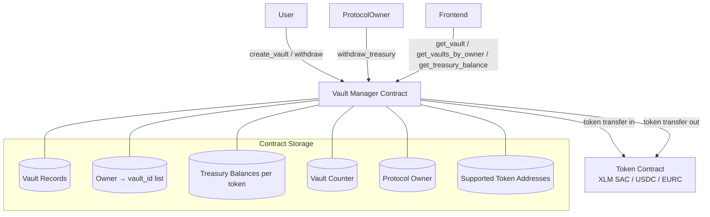
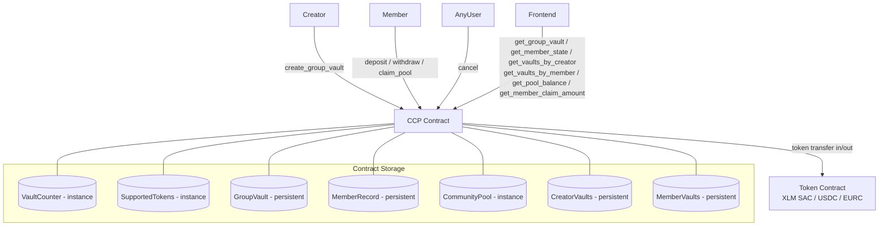

# Shadow-Stellar

Shadow-Stellar is a zero-knowledge vault protocol on the Stellar blockchain, built with Soroban smart contracts. It combines four independently deployable contracts:

- **Time-Locked Vault (TLV)** — Solo vaults: lock XLM, USDC, or EURC for a fixed duration with Strict or Penalty lock types.
- **Collective Commitment Protocol + ZK (CCP)** — Group escrow: 5–100 members collectively lock funds, enforced by a funding deadline, with early-exit penalties redistributed to committed members. Full ZK privacy layer with BN254 Pedersen commitments (replaced SHA-256 hash-based) and embedded UltraHONK verifier.
- **ZK Commitment Protocol (ZCP)** — Standalone private vaults: deposit amounts are committed via BN254 Pedersen commitments (`amount·G + blinding·H`) — never stored in plaintext on-chain. Withdrawal requires knowledge of the blinding factor. **Embedded UltraHONK zk-SNARK verification** (UltraHonkVerifier baked into the contract, no cross-contract call) via `zk_deposit_ultrahonk` / `zk_withdraw_ultrahonk`.
- **Shadow ZK Verifier** — Real zk-SNARK verification contract using UltraHONK (Barretenberg) proved on Stellar's BN254 host functions. Compiled Noir circuits generate proofs off-chain; the contract verifies them on-chain via sumcheck + Shplemini batch-opening + BN254 pairing check.

The frontend (`Shadow-Stellar-app`) is a React 19 + Vite + TanStack Router dApp supporting all three contract types. It supports Freighter, xBull, Albedo, Rabet, Lobstr, and Hana wallets via the Stellar Wallets Kit.

# [Demo website](https://shadow-stellar.vercel.app/)

The "trusted individual" — the vault creator — earns two things:

**1. Creator Commission (5%)**
Every time a member deposits, 5% goes immediately to the creator's wallet. This happens on-chain at deposit time — no claiming needed.

Example with 5 members each depositing 100 XLM:
- Member 1 deposits → creator gets 5 XLM instantly
- Member 2 deposits → creator gets 5 XLM instantly
- Member 3 deposits → creator gets 5 XLM instantly
- Member 4 deposits → creator gets 5 XLM instantly
- Member 5 deposits → creator gets 5 XLM instantly
- Total creator earnings: **25 XLM** just for creating the vault

**2. Nothing from the penalty pool**
The creator does NOT get any share of the early-exit penalty pool. That pool is distributed equally among members who stayed committed to maturity. The creator only earns the upfront commission.


---

## Architecture — Time-Locked Vault



The contract has no external oracle dependency. All time checks use `env.ledger().timestamp()`.

---

## Architecture — Collective Commitment Protocol



All time checks use `env.ledger().timestamp()`. No external oracle dependency.

---

## Data Indexing

We track contract events using Stellar Expert's built-in event viewer.

### Event Endpoints

| Contract | Events URL |
|---|---|
| Time-Locked Vault v2 | https://stellar.expert/explorer/testnet/contract/CABGIDBEGTWZQLGVSZRLGR44PN3Q32QKV5PVD6BZLH4KGBLJDL7ZEZ3H/events |
| CCP + ZK v3 (SDK 26) | https://stellar.expert/explorer/testnet/contract/CDJRALESLSOS7UUYXSQTPUUJQVGYZQ4PJIWFRYNSS4RO5QLWHITYK5IQ/events |
| ZK Commitment Protocol v3 (SDK 26) | https://stellar.expert/explorer/testnet/contract/CBIJMJ6SDKD2CPTFBKE4APC7ATFNGOX7XMOFCI47YFSRQNDFLBBDPLLI/events |

**Security:** [Completed Security Checklist](./Security.md)

---

## TLV — Penalty Calculation

```
penalty = floor(amount * penalty_rate / 10000)
payout  = amount - penalty
```

`payout + penalty == amount` always holds — no value lost. Any fractional basis-point remainder stays with the user in `payout`.

---

## TLV — Access Control

| Operation | Auth Required |
|---|---|
| `create_vault` | `caller.require_auth()` |
| `withdraw` | `caller.require_auth()` — must equal `vault.owner` |
| `withdraw_treasury` | `caller.require_auth()` — must equal stored `protocol_owner` |
| `get_vault` / `get_vaults_by_owner` / `get_treasury_balance` | None — read-only |

---

## TLV — Error Types

| Code | Variant |
|---|---|
| 1 | `AlreadyInitialized` |
| 2 | `NotInitialized` |
| 10 | `InvalidAmount` |
| 11 | `InvalidUnlockTime` |
| 12 | `UnsupportedToken` |
| 13 | `InvalidPenaltyRate` |
| 20 | `VaultNotFound` |
| 21 | `AlreadyWithdrawn` |
| 22 | `EarlyExitNotAllowed` |
| 30 | `Unauthorized` |
| 40 | `TreasuryEmpty` |
| 50 | `TransferFailed` |

---

## CCP — Error Types

| Code | Variant |
|---|---|
| 1 | `AlreadyInitialized` |
| 2 | `NotInitialized` |
| 10 | `InvalidMemberCount` |
| 11 | `MemberAmountMismatch` |
| 12 | `InvalidObligationAmount` |
| 13 | `UnsupportedToken` |
| 14 | `InvalidUnlockTime` |
| 15 | `InvalidFundingDeadline` |
| 16 | `InvalidPenaltyRate` |
| 20 | `VaultNotFound` |
| 21 | `NotMember` |
| 22 | `WrongVaultState` |
| 23 | `WrongMemberState` |
| 24 | `FundingDeadlinePassed` |
| 25 | `FundingDeadlineNotPassed` |
| 26 | `EarlyExitNotAllowed` |
| 30 | `Unauthorized` |
| 40 | `TransferFailed` |
| 50 | `InvalidZkProof` |
| 51 | `NullifierAlreadyUsed` |
| 52 | `ZkAmountMismatch` |
| 53 | `SchnorrVerificationFailed` |
| 54 | `VaultIsPrivacyMode` |
| 55 | `VaultNotPrivacyMode` |
| 56 | `ZkMemberSlotNotFound` |
| 60 | `VerifierNotSet` |
| 61 | `UltraHonkProofFailed` |

---

## CCP — Penalty & Pool Distribution

```rust
// Penalty: floor(amount * rate / 10_000), invariant: payout + penalty == amount
let penalty = amount * (penalty_rate as i128) / 10_000;
let payout  = amount - penalty;

// Pool share: equal distribution with remainder to first claimer
let base      = original_pool / eligible_claimers as i128;
let remainder = original_pool % eligible_claimers as i128;
// first claimer (claimed_count == 0) gets base + remainder
```

---

## Property-Based Tests

Use [proptest](https://github.com/proptest-rs/proptest) (Rust) with a minimum of 100 iterations per property.
Each test is tagged with a comment in the format:
`// Feature: time-locked-vault, Property N: <property_text>`

| Property | Generator Strategy | Assertion |
|---|---|---|
| P1: Vault creation round-trip | Arbitrary (token ∈ {xlm,usdc,usdt}, amount ∈ [1, i128::MAX/2], unlock_time ∈ [now+1, now+10^9], lock_type, penalty_rate ∈ [1,10000] for PENALTY) | get_vault fields match inputs; state == Active |
| P2: Invalid inputs rejected | amount ∈ (-∞, 0], unlock_time ∈ (-∞, now], random non-supported address, rate ∈ {0} ∪ [10001, u32::MAX] | Returns appropriate error; get_vault returns VaultNotFound |
| P3: Owner index completeness | N ∈ [1,20] vaults for same owner | get_vaults_by_owner contains all returned vault_ids |
| P4: Mature withdrawal returns full amount | Arbitrary vault, ledger advanced past unlock_time | Balance delta == amount; state == Withdrawn |
| P5: Unauthorized withdrawal rejected | Arbitrary vault, caller ≠ owner | Returns Unauthorized; state unchanged |
| P6: Double withdrawal rejected | Arbitrary vault, withdraw twice | Second call returns AlreadyWithdrawn |
| P7: Penalty arithmetic invariant | amount ∈ [1, 10^18], penalty_rate ∈ [1, 10000] | penalty == floor(amount * rate / 10000); payout + penalty == amount |
| P8: STRICT vault blocks early exit | Arbitrary STRICT vault, ledger time < unlock_time | Returns EarlyExitNotAllowed; state == Active |
| P9: Treasury accumulation and drain | N ∈ [1,10] early withdrawals, varying amounts and rates | sum(penalties) == treasury balance; after drain, balance == 0 and owner received sum |
| P10: Unauthorized treasury withdrawal | Arbitrary caller ≠ protocol_owner | Returns Unauthorized; treasury balance unchanged |

## Integration Tests (Testnet)

Run against a deployed contract on Stellar testnet using the Stellar SDK:

- Full end-to-end: create → wait → withdraw for each token type
- Early exit flow with real token balances
- Treasury drain by protocol owner
- Frontend-facing queries: `get_vault`, `get_vaults_by_owner`, `get_treasury_balance`
- Event indexing: verify events appear in transaction metadata


**Summary**

| Source | Creator earns | When |
|---|---|---|
| Member deposits | 5% of each deposit | Immediately at deposit time |
| Penalty pool | 0% | N/A |
| Mature withdrawals | 0% | N/A |

So if you create a vault with 100 members each depositing 1000 XLM, you earn **5,000 XLM** just from the commission — before the lock period even starts.

---

## Contracts

> **All contracts are deployed on Stellar Testnet.**
> Protocol Owner: `GBAWEM6LAMZQIW6JRQPLEIZBZTQHRCUYGTZNCYIWD2BXOF4DE4QYA7OM`

---

### 1. Time-Locked Vault (TLV) — v2

A single-user vault that locks XLM, USDC, or EURC for a defined period. Two lock modes: Strict (no early exit) or Penalty (early exit with a basis-point fee forwarded to the protocol treasury).

| Item | Value |
|---|---|
| **Contract** | `CABGIDBEGTWZQLGVSZRLGR44PN3Q32QKV5PVD6BZLH4KGBLJDL7ZEZ3H` |
| Explorer | https://stellar.expert/explorer/testnet/contract/CABGIDBEGTWZQLGVSZRLGR44PN3Q32QKV5PVD6BZLH4KGBLJDL7ZEZ3H |
| Stellar Lab | https://lab.stellar.org/r/testnet/contract/CABGIDBEGTWZQLGVSZRLGR44PN3Q32QKV5PVD6BZLH4KGBLJDL7ZEZ3H |
| Deploy Tx | `2e9712638db77333656a9ff11d1b4103b5b226bf109a97549576a783ed2c33b0` |
| Init Tx | `8014fcee44375e7b6caa9e1fe304428504c1f4939f9baba008cc8d87dd0af8bd` |

**Functions:** `initialize` · `create_vault` · `withdraw` · `withdraw_treasury` · `get_vault` · `get_vaults_by_owner` · `get_treasury_balance`

---

### 2. Collective Commitment Protocol + ZK Module (CCP) — v3 (SDK 26)

Multi-user group escrow with enforced participation, funding deadlines, early-exit penalties, community pool redistribution, 5% creator commission, and a full zero-knowledge privacy layer for private group vaults. BN254 Pedersen commitments (via `env.crypto().bn254().g1_msm()`); embedded UltraHonk verifier; WASM 105 KB.

| Item | Value |
|---|---|
| **Contract** | `CDJRALESLSOS7UUYXSQTPUUJQVGYZQ4PJIWFRYNSS4RO5QLWHITYK5IQ` |
| Explorer | https://stellar.expert/explorer/testnet/contract/CDJRALESLSOS7UUYXSQTPUUJQVGYZQ4PJIWFRYNSS4RO5QLWHITYK5IQ |
| Stellar Lab | https://lab.stellar.org/r/testnet/contract/CDJRALESLSOS7UUYXSQTPUUJQVGYZQ4PJIWFRYNSS4RO5QLWHITYK5IQ |
| Deploy Tx | `bcbad6706580291f6b4b325f229d091429cc047db299b96bed3f30efdf32113c` |
| Init Tx | `546f317a0f99506c4bc8461df9925d3aa1040b15527b42874b2a66529ced79d4` |

**Standard Functions:** `create_group_vault` · `deposit` · `withdraw` · `cancel` · `claim_pool` · `get_group_vault` · `get_member_state` · `get_vaults_by_member` · `get_vaults_by_creator` · `get_pool_balance` · `get_member_claim_amount`

**ZK Privacy Functions:** `create_group_vault_zk` · `deposit_zk` · `withdraw_zk` · `claim_pool_zk` · `deposit_zk_ultrahonk` · `is_nullifier_spent` · `get_zk_vault` · `get_zk_member_record_fn` · `get_vault_privacy_mode`

---

### 3. ZK Commitment Protocol (ZCP) — v3 (SDK 26)

A standalone zero-knowledge vault contract. Users lock XLM, USDC, or EURC backed by a BN254 Pedersen commitment (`amount·G + blinding·H` compressed to 32-byte x-coordinate) — the deposit amount is never stored in plaintext on-chain. Withdrawal requires submitting the blinding factor; the contract recomputes the commitment from `(amount, blinding)` and verifies it matches the stored value. Includes a permanent spent-nullifier registry that prevents replay attacks. Embedded UltraHonk verifier; WASM 69 KB.

| Item | Value |
|---|---|
| **Contract** | `CBIJMJ6SDKD2CPTFBKE4APC7ATFNGOX7XMOFCI47YFSRQNDFLBBDPLLI` |
| Explorer | https://stellar.expert/explorer/testnet/contract/CBIJMJ6SDKD2CPTFBKE4APC7ATFNGOX7XMOFCI47YFSRQNDFLBBDPLLI |
| Stellar Lab | https://lab.stellar.org/r/testnet/contract/CBIJMJ6SDKD2CPTFBKE4APC7ATFNGOX7XMOFCI47YFSRQNDFLBBDPLLI |
| Deploy Tx | `64342ad10bbe9f3d2f04e465449f08f817c2b8f495900e9fe445723bb3f576e4` |
| Init Tx | `2d9741ebc0abf562ac2569f884355392476632a21e126e73e669c82a7071d4ca` |

**Functions:** `zk_deposit` · `zk_withdraw` · `zk_deposit_ultrahonk` · `zk_withdraw_ultrahonk` · `verify_range_proof` · `is_nullifier_spent_fn` · `get_entry_fn` · `get_entries_by_depositor` · `get_commitment` · `get_next_entry_id`

---

### Testnet Deployment Summary

| Contract | Address | Status |
|---|---|---|---|
| Time-Locked Vault v2 | `CABGIDBEGTWZQLGVSZRLGR44PN3Q32QKV5PVD6BZLH4KGBLJDL7ZEZ3H` | ✅ Live |
| CCP + ZK v3 (SDK 26) | `CDJRALESLSOS7UUYXSQTPUUJQVGYZQ4PJIWFRYNSS4RO5QLWHITYK5IQ` | ✅ Live |
| ZK Commitment Protocol v3 (SDK 26) | `CBIJMJ6SDKD2CPTFBKE4APC7ATFNGOX7XMOFCI47YFSRQNDFLBBDPLLI` | ✅ Live |
| Shadow ZK Verifier | **Embedded** — UltraHonkVerifier integrated into CCP & ZCP | ✅ Built-in |

**Network:** Stellar Testnet · RPC: `https://soroban-testnet.stellar.org` · Horizon: `https://horizon-testnet.stellar.org`

**Supported Assets (all contracts):**

| Asset | SAC Address |
|---|---|
| XLM | `CDLZFC3SYJYDZT7K67VZ75HPJVIEUVNIXF47ZG2FB2RMQQVU2HHGCYSC` |
| USDC | `CBIELTK6YBZJU5UP2WWQEUCYKLPU6AUNZ2BQ4WWFEIE3USCIHMXQDAMA` |
| EURC | `CCUUDM434BMZMYWYDITHFXHDMIVTGGD6T2I5UKNX5BSLXLW7HVR4MCGZ` |

---


## List of 5+ user wallet addresses (verifiable on Stellar Explorer)
```
Address 1: `GBBANYQN6ET2V5A7Z4IP2VWBTYSGUDGZ522UCKVUAJ2C4XF6NNEOL7ZT`
Address 2: `GAKBJ25VKX7TOUXCPHKKFWK7LFERR4WP5C5USMP5WS5ZCYB67PX4THUB`
Address 3: `GDQJC4I7ND6LI36KU3WCXARCLQ7JJ5HKGBM67MCBROGG57ZABACR4SK2`
Address 4: `GC3PHHDPOGQZD243G4PISLE274Q4W3ETL2NPNGBE5TNHEVWMWSP7RJKM`
Address 5: `GCEPBDZAVKSWMODTNVHPTRBSPBZMOECIC7WP77KDNBSZBAZBQO4NO6J7`
```


## List of 34 user wallet addressess using this application (verifiable on Stellar Explorer)

```
Address 1: GBBANYQN6ET2V5A7Z4IP2VWBTYSGUDGZ522UCKVUAJ2C4XF6NNEOL7ZT
Address 2: GAKBJ25VKX7TOUXCPHKKFWK7LFERR4WP5C5USMP5WS5ZCYB67PX4THUB
Address 3: GDQJC4I7ND6LI36KU3WCXARCLQ7JJ5HKGBM67MCBROGG57ZABACR4SK2
Address 4: GC3PHHDPOGQZD243G4PISLE274Q4W3ETL2NPNGBE5TNHEVWMWSP7RJKM
Address 5: GCEPBDZAVKSWMODTNVHPTRBSPBZMOECIC7WP77KDNBSZBAZBQO4NO6J7
Address 6: GCQQZZN5Q5HL372Q4PGO564FF7AXM2QHZUEBEFOFXX4FNYIR7PJDGJMK
Address 7: GAFWFDVZ6LKOUTGQESFVEONFHKVBZXT4EVQREVKF5RW46JLMD2PVR27J
Address 8: GAQ5JIAEZC23RWADY4JM7JH6CBISI4RKPFROJ3OCJ757Q77KMRTWJIDF
Address 9: GBI3NZAFYX75V6FSKZ2NUSQSVKOSI457VC223ICOI6FAN2HR2HK77AOL
Address 10: GDIYRLE42PYF37RSNPS7ZRC2JNTT3LN3H2S6RULYZ5ZR4UGVWN53CYPF
Address 11: GC6LT7FKTJ2S6FOJFAPIKGUGQWPVQE7KGTHEFOBVSECBMU7GUIIXUDHV
Address 12: GCDYTM6YONT5IT6YB5N46R6VNAQJ5BOHSN7YSPKHDJOUP4DEK4WEAJ3C
Address 13: GDHH2XZPDWP6Y45T7SOLD5Y3JZ7PQW2ENLUIKBYTNZB2I5IJTP4BZ24Q
Address 14: GCZYGOHXNAPJTGNBAHMZLRVSXUXWSEE7LTI5UWBJTEPFKYZSQEVC6ASF
Address 15: GBO5LXAVADAR67O4NOF3ZLDAHRNYYDTW7HFECUY6VEKK5VLUW46TW5NF
Address 16: GAWY4CIBREPHHCBRQSTR3UIFVOPWYRGV7EDFTV5544B64LYQO2XPPJBA
Address 17: GDDKVIILHZVXF23OL6BUXZC6PJFTIPY2J7HX7U3HC7KWYCJL5JC66ETJ
Address 18: GBINREP3QUWFY5HHGOEWEVQHMI64N3O24ZEJEEZD22JOFIB3OJ2WE4IB
Address 19: GAXRZGEH2OBN7DHLQCE2RC63FJKF64MZLC2FVFSBMGGGSLL7AG75VREJ
Address 20: GAXPDAHTX5LMMDI6B54BFRLOZ2O4EJPXBB6VB3PCKUIZOOWLVXLOBCQN
Address 21: GCAYNBYVRXEV72IH4EHXIS2OBU4C74HPXFHDIIOWWNATZPT2VY2SW6PK
Address 22: GBVJZALWL7PN6NYCIT4A2XRF6IHAVJDXE4EKNNXYSFVJUMSXZAFWAPGO
Address 23: GBSELHWK36GG3ZIKBBYUJ64DYNIH4UWRNMR6PL5HVHL5MFYK7PZ52OA4
Address 24: GAFJ3BDOY234WPDMOK6T3Y2U7BKE45Y4DIB2J5YWEKT72NI6H7LAEOP5
Address 25: GCBGEWR3JLZJHT232FN4L243XGF5W42RG36SJ6V77UXAUJSRZRSAAWRV
Address 26: GB7LC2ETACZVF4T7J5AXYZ2ASA25X2HQ342LFOUVKF57RIDV37BJ4ZK4
Address 27: GAFZNT7PQGU4W4MU2B2DKDJC7Y3FFOGJ55ODSAQPS7BPI7R3GLDL32IK
Address 28: GDKRFEO6WNIBDYJMHV5SWR3UNK5UJAFS5CE25JQJT4XZDSEHWSBNACHX
Address 29: GC2NXXTCDDQXL66MUH46SBNF3YU3PE5O7VCZJP5BW6LROLUK6DDVU2MA
Address 30: GBS2OA2THAZHNNANPWR2NXXXZPKTAJ2WOQFAWMUZKHCUKEAVTBQEH5L3
Address 31: GAR42NJFT5TWRIC55NPHKHPAI4INPORFWCXC7IVSDOVP4VOG5E2U633W
Address 32: GB6322XKTRZX7MQ2XHKMFO4WKXHGJZFMGJZPRU7DZSYQGXZYV2MHHHPA
Address 33: GDXP4TAXOP4DZRKGVU5N667VZ77OWBEB53GQEP5QEPE66PMWM3PGWASM
Address 34: GBGRMM55HLIVPCXMAEE4CO55LPRQTV5ZHSGSHHNXQBJDYNI3E7JE5THW
```
TIME-LOCKED VAULT PROTOCOL –  


A decentralized private vault protocol on Stellar — solo vaults, collective group commitment, and zero-knowledge private commitments.
## Supported Assets (all contracts)

| Asset | SAC Address (Testnet) |
|---|---|
| XLM | `CDLZFC3SYJYDZT7K67VZ75HPJVIEUVNIXF47ZG2FB2RMQQVU2HHGCYSC` |
| USDC | `CBIELTK6YBZJU5UP2WWQEUCYKLPU6AUNZ2BQ4WWFEIE3USCIHMXQDAMA` |
| EURC | `CCUUDM434BMZMYWYDITHFXHDMIVTGGD6T2I5UKNX5BSLXLW7HVR4MCGZ` |

---

## Project Structure

```
Shadow-Stellar/
├── time-locked-vault/              # Solo vault contract (Rust/Soroban)
│   ├── Cargo.toml
│   └── src/
│       ├── lib.rs                  # initialize, create_vault, withdraw, withdraw_treasury, queries
│       ├── types.rs                # LockType, VaultState, Vault, event structs
│       ├── storage_types.rs        # DataKey, VaultError
│       ├── storage.rs              # Storage helpers, TTL management
│       ├── utils.rs                # calculate_penalty, token_client
│       ├── tests.rs                # 23 unit tests
│       └── integration_tests.rs
├── collective-commitment-protocol/ # CCP + ZK group vault contract (Rust/Soroban)
│   ├── Cargo.toml
│   └── src/
│       ├── lib.rs                  # 12 standard + 8 ZK public functions
│       ├── types.rs                # VaultState, MemberState, LockType, ZkGroupVault, ZkMemberRecord
│       ├── storage_types.rs        # DataKey (incl. ZK keys), CcpError (incl. ZK errors)
│       ├── storage.rs              # Storage helpers, ZK nullifier registry, TTL management
│       ├── utils.rs                # calculate_penalty, maybe_transition_zk, state helpers
│       ├── zk/                     # Zero-knowledge module
│       │   ├── mod.rs              # ZK module root + re-exports
│       │   ├── field.rs            # Fp arithmetic over Ed25519 scalar field
│   │   ├── pedersen.rs         # BN254 Pedersen commitments (g1_msm) + SHA-256 nullifiers
│       │   ├── proof.rs            # ZkDepositProof, ZkEarlyExitProof, ZkMembershipProof structs
│       │   └── verifier.rs         # On-chain proof verification functions
│   ├── tests.rs                # 50 unit tests (40 CCP + 10 ZK field)
│       └── integration_tests.rs
├── zk-commitment-protocol/         # Standalone ZK vault contract (Rust/Soroban)
│   ├── Cargo.toml
│   └── src/
│       ├── lib.rs                  # initialize, zk_deposit, zk_withdraw, verify_range_proof, queries
│       ├── zk_types.rs             # ZkVaultEntry, ZkDepositProof, ZkWithdrawProof, ZkError, UltraHonkDepositProof
│   ├── zk_crypto.rs            # BN254 Pedersen commitment (g1_msm) + SHA-256 nullifier/range-tag
│       ├── storage.rs              # Entry registry, nullifier registry, depositor index, verifier address
│   ├── verifier.rs             # verify_deposit, verify_withdraw, verify_range, verify_ultrahonk (embedded)
│   └── tests.rs                # 23 unit tests
├── crates/
│   └── ultrahonk-soroban-verifier/ # Vendored UltraHONK verifier crate (from rs-soroban-ultrahonk)
│       ├── Cargo.toml
│       └── src/
│           ├── lib.rs              # Crate root, trace! macro
│           ├── field.rs            # BN254 Fr arithmetic via host functions
│           ├── ec.rs               # G1 MSM, BN254 pairing check
│           ├── hash.rs             # Keccak256 Fiat-Shamir transcript
│           ├── types.rs            # Wire, G1Point, VerificationKey, Proof, Transcript
│           ├── transcript.rs       # 9-round Fiat-Shamir challenge generation
│           ├── relations.rs        # 26 subrelations across 8 families
│           ├── sumcheck.rs         # Barycentric sumcheck verifier (28 rounds)
│           ├── shplemini.rs        # Gemini + Shplonk + KZG batch-opening
│           ├── verifier.rs         # UltraHonkVerifier orchestration
│           ├── utils.rs            # Proof/VK deserialization (fixed-size layout)
│           └── debug.rs            # Trace logging utilities
├── circuits/                       # Noir zero-knowledge circuits
│   └── private_vault/             # Poseidon2-based commitment proof circuit
│       ├── Nargo.toml
│       └── src/main.nr             # Proves: commitment == poseidon2(secret, recipient, amount)
├── scripts/                        # Build and deploy utilities
│   ├── build_noir.sh              # Compile Noir circuits, generate proofs + VK
│   └── deploy-testnet.sh          # Deploy CCP + ZCP to testnet
├── Shadow-Stellar-app/             # React 19 frontend (Vite + TanStack Router)
│   └── src/
│       ├── lib/
│       │   ├── contract.ts         # TLV Soroban client
│       │   ├── ccp-contract.ts     # CCP + ZK Soroban client
│   │   ├── stellar-bn254.ts    # Stellar BN254 curve (weierstrass) + Pedersen helpers
│   │   ├── zk-contract.ts      # ZCP client + off-chain prover (BN254 Pedersen)
│       │   ├── stellar-helper.ts   # Stellar Wallets Kit integration
│       │   ├── assets.ts           # Asset registry (XLM, USDC, EURC)
│       │   └── format.ts           # Date/time formatting incl. UTC/GMT/WAT
│       ├── store/
│       │   ├── wallet.ts           # Wallet state (connect, sign, balances)
│       │   ├── vaults.ts           # TLV vault state
│       │   ├── group-vaults.ts     # CCP vault state
│       │   └── zk-vaults.ts        # ZK vault state (stores blinding factors locally)
│       └── routes/
│           ├── index.tsx           # Dashboard (all 3 vault types)
│           ├── create.tsx          # Solo vault creation wizard
│           ├── vaults.$vaultId.tsx # Solo vault detail + withdraw
│           ├── vaults.index.tsx    # Solo vault list
│           ├── group.index.tsx     # Group vault list
│           ├── group.create.tsx    # Group vault creation wizard
│           ├── group.$vaultId.tsx  # Group vault detail + deposit/withdraw/cancel/claim
│           ├── zk.index.tsx        # ZK vault list
│           ├── zk.create.tsx       # ZK vault creation wizard
│           ├── zk.$entryId.tsx     # ZK vault detail + withdrawal proof flow
│           └── history.tsx         # Transaction history
└── .kiro/specs/
    ├── time-locked-vault/          # TLV spec
    └── collective-commitment-protocol/ # CCP spec
```

---

## Time-Locked Vault — Reference

### Functions

| Function | Description |
|---|---|
| `initialize(protocol_owner, xlm, usdc, eurc)` | One-time setup |
| `create_vault(caller, token, amount, unlock_time, lock_type, penalty_rate)` | Lock funds → `vault_id` |
| `withdraw(caller, vault_id)` | Withdraw at maturity or early (penalty vaults only) |
| `withdraw_treasury(caller, token)` | Protocol owner drains penalty fees |
| `get_vault(vault_id)` | Read vault record |
| `get_vaults_by_owner(owner)` | List vault IDs for an owner |
| `get_treasury_balance(token)` | Read accumulated penalty balance |

### Events

| Topic | Trigger |
|---|---|
| `vault_crt` | Vault created |
| `withdrawn` | Mature withdrawal |
| `early_wdr` | Early withdrawal (with penalty) |
| `treas_wdr` | Treasury drained |

---

## CCP — Group Vault Lifecycle

### Vault States

| State | Description |
|---|---|
| `FundingOpen` | Waiting for all members to deposit before the funding deadline |
| `ActiveLocked` | All members deposited — funds locked until `unlock_time` |
| `SettlementReady` | Unlock time reached — members can withdraw and claim pool |
| `Resolved` | All members claimed — vault fully closed |
| `Cancelled` | Deadline passed without full funding — depositors get full refunds |

### Member States

| State | Description |
|---|---|
| `Committed` | Added to vault, hasn't deposited yet |
| `Deposited` | Deposited, waiting for others |
| `Active` | Vault fully funded and locked |
| `Exited` | Exited early — penalty forfeited to community pool (irreversible) |
| `Withdrawn` | Withdrew principal at maturity |
| `Claimed` | Claimed pool share |

### Full Lifecycle

```
create_group_vault  →  all members: Committed
deposit (×N)        →  each member: Deposited
last deposit        →  all: Active · vault: ActiveLocked
unlock_time passes  →  vault: SettlementReady
withdraw            →  member: Withdrawn
claim_pool          →  member: Claimed
all claimed         →  vault: Resolved

funding_deadline passes without full funding:
  cancel()  →  vault: Cancelled  →  withdraw() refunds each depositor
```

### Creator Commission

5% of each member's deposit is transferred immediately to the vault creator at deposit time. The remaining 95% is locked.

Example: member deposits 100 XLM → creator receives 5 XLM instantly, 95 XLM locked.

---

## CCP — How Group Vaults Work (User Guide)

When you create a group vault, you add 5–100 member wallet addresses and set a funding deadline.

Each member visits `/group/$vaultId` with their wallet connected. If their state is **Committed** and the deadline hasn't passed, they see a deposit button. They click it, sign, and their funds go directly into the contract.

Members do **not** deposit to your address — they deposit to the contract address. The contract holds all funds in escrow. Nobody (including the creator) can touch them outside the contract logic.

Members find the vault automatically when they connect their wallet on the Group Vaults page (they were added by address at creation time). You can also share the direct URL `/group/$vaultId`.

If funding fails: once the deadline passes, anyone calls `cancel`. The vault cancels and every depositor claims a full refund.

---

## CCP — Functions

| Function | Description |
|---|---|
| `initialize(xlm, usdc, eurc, verifier?)` | One-time setup (optional UltraHonk verifier address) |
| `create_group_vault(creator, token, members, amounts, unlock_time, funding_deadline, lock_type, penalty_rate)` | Create vault → `vault_id` |
| `deposit(caller, vault_id)` | Member deposits exact obligation |
| `withdraw(caller, vault_id)` | Refund / mature withdrawal / early exit |
| `cancel(vault_id)` | Cancel after deadline — anyone can call |
| `claim_pool(caller, vault_id)` | Claim equal pool share at settlement |
| `get_group_vault(vault_id)` | Read vault record |
| `get_member_state(vault_id, member)` | Read member record |
| `get_vaults_by_creator(creator)` | List vault IDs by creator |
| `get_vaults_by_member(member)` | List vault IDs by member |
| `get_pool_balance(vault_id)` | Read community pool balance |
| `get_member_claim_amount(vault_id, member)` | Preview pool share |

**ZK Privacy Functions:** `create_group_vault_zk` · `deposit_zk` · `withdraw_zk` · `claim_pool_zk` · `deposit_zk_ultrahonk` · `is_nullifier_spent` · `get_zk_vault` · `get_zk_member_record_fn` · `get_vault_privacy_mode`

### Events

| Topic | Trigger |
|---|---|
| `grp_crt` | Group vault created |
| `mem_dep` | Member deposited |
| `vlt_act` | Vault activated (fully funded) |
| `vlt_can` | Vault cancelled |
| `mem_exit` | Member early exit |
| `mem_wdr` | Member withdrawn |
| `pool_clm` | Pool share claimed |
| `vlt_res` | Vault resolved |
| `zk_crt` | ZK privacy vault created |
| `zk_dep` | ZK deposit |
| `zk_wdr` | ZK withdrawal |
| `zk_exit` | ZK early exit |
| `zk_clm` | ZK pool claim |

---

## Frontend (Shadow-Stellar-app)

### Stack

- Vite 7 + React 19 + TypeScript
- TanStack Router (file-based routing)
- Zustand (wallet + vault state, persisted in localStorage)
- `@creit.tech/stellar-wallets-kit` (wallet modal — Freighter, xBull, Albedo, Rabet, Lobstr, Hana)
- `@stellar/stellar-sdk` (Soroban RPC — lazy loaded, SSR-safe)
- Tailwind CSS v4 — custom "Machined Titanium" dark design system
- Framer Motion for animations

### Routes

| Path | Description |
|---|---|
| `/` | Dashboard — all vault types, locked totals, contract links |
| `/create` | Solo vault creation (6-step wizard) |
| `/vaults` | Solo vault list |
| `/vaults/:id` | Solo vault detail + withdraw |
| `/group` | Group vault list |
| `/group/create` | Group vault creation (6-step wizard) |
| `/group/:id` | Group vault detail + deposit/withdraw/cancel/claim |
| `/zk` | ZK vault list + how-it-works explainer |
| `/zk/create` | ZK vault creation — generates blinding factor in browser |
| `/zk/:entryId` | ZK vault detail — shows commitment, nullifier, blinding factor, withdraw proof |
| `/history` | Transaction history |

### ZK Privacy Flow

#### Proof Modes

The app offers two proof modes for both ZK vaults (ZCP) and ZK group vaults (CCP ZK):

**SHA-256 (auto) — default, no external tools needed:**
1. A blinding factor is derived deterministically from your wallet address using SHA-256 (no random value to lose)
2. `commitment = amount·G + blinding·H` — BN254 Pedersen (compressed to 32-byte x-coordinate), computed in-browser via `@noble/curves`
3. `nullifier = SHA-256(DOMAIN_NULLIFIER || entry_id_le || commitment)` — anti-replay token
4. `range_tag = SHA-256(DOMAIN_RANGE || commitment || amount || 1 || amount)` — range proof
5. Proof is submitted to `zk_deposit` / `deposit_zk` — only the commitment x-coordinate is stored on-chain
6. To withdraw: the blinding factor is recomputed from your address, the contract recomputes `commitment' = amount·G + blinding·H`, and verifies equality

For group ZK vaults, the member secret is provided by the vault creator — paste it on the vault detail page to unlock your membership, then deposit with one click (SHA-256 auto mode).

**UltraHONK SNARK — advanced, requires an external prover:**
1. You run a Noir circuit with your private inputs (amount, blinding, etc.) using `nargo` + `bb` (Barretenberg) off-chain
2. The prover outputs three hex values: **commitment** (64 hex chars), **proof bytes** (29,184 hex chars), and **public inputs**
3. Paste these into the corresponding fields in the browser UI
4. The contract verifies the UltraHonk zk-SNARK on-chain via the embedded verifier (sumcheck → Shplemini → BN254 pairing)
5. No blinding factor is stored in localStorage — the proof itself authorizes the withdrawal

See the [Real ZK Integration](#real-zk-integration-ultrahonk--noir) section below for proof generation setup and version compatibility notes.

> **For most users:** Use SHA-256 (auto). UltraHonk is only needed if you want to generate proofs with your own Noir circuits or use a non-deterministic blinding factor.

The blinding factor (SHA-256 mode) is stored in the browser's localStorage. **Users should export and back it up from the ZK vault detail page.**

### Wallet Connection

Clicking "Connect Wallet" opens the Stellar Wallets Kit modal. Supported wallets: Freighter · xBull · Albedo · Rabet · Lobstr · Hana

### Timezone Display

Vault unlock times shown in UTC, GMT, and WAT (UTC+1) on vault detail pages.

### Running the Frontend

```bash
cd Shadow-Stellar-app
npm install
npm run dev
```

Build:

```bash
npm run build
```

---

## Building the Contracts

Requires Rust with `wasm32v1-none` and Soroban SDK 26.1.0+:

```bash
rustup target add wasm32v1-none
```

> **Note:** All contracts use `soroban-sdk = "26.1.0"` with `features = ["alloc"]` (required by `wasm32v1-none` target). The SDK upgrade from v22→v26 also enables native BN254 host functions for `g1_msm` Pedersen commitments.

Build TLV:
```bash
cargo build --manifest-path time-locked-vault/Cargo.toml \
  --target wasm32v1-none --release
```

Build CCP + ZK:
```bash
cargo build --manifest-path collective-commitment-protocol/Cargo.toml \
  --target wasm32v1-none --release
```

Build ZK Commitment Protocol:
```bash
cargo build --manifest-path zk-commitment-protocol/Cargo.toml \
  --target wasm32v1-none --release
```

> The UltraHonk verifier is **embedded** into both CCP and ZCP (as a path dependency `ultrahonk_soroban_verifier`). No separate `shadow-zk-verifier` deploy is needed.

Compile Noir circuits (requires nargo + bb):
```bash
./scripts/build_noir.sh
```

Run TLV tests (23):
```bash
cargo test --manifest-path time-locked-vault/Cargo.toml
```

Run CCP tests (50):
```bash
cargo test --manifest-path collective-commitment-protocol/Cargo.toml
```

Run ZCP tests (23):
```bash
cargo test --manifest-path zk-commitment-protocol/Cargo.toml
```

---

## Deploying

Requires the [Stellar CLI](https://developers.stellar.org/docs/tools/developer-tools/cli/stellar-cli).

### Quick Deploy (CCP + ZCP)

```bash
# Uses identity $STELLAR_IDENTITY (default: shadow-stellar-admin)
# Deploys both CCP and ZCP, prints contract IDs
bash scripts/deploy-testnet.sh
```

### Deploy Time-Locked Vault v2

```bash
stellar keys generate deployer --network testnet
stellar keys fund deployer --network testnet

stellar contract optimize --wasm time-locked-vault/target/wasm32v1-none/release/time_locked_vault.wasm

stellar contract deploy \
  --wasm time-locked-vault/target/wasm32v1-none/release/time_locked_vault.optimized.wasm \
  --source deployer --network testnet
# → CABGIDBEGTWZQLGVSZRLGR44PN3Q32QKV5PVD6BZLH4KGBLJDL7ZEZ3H

stellar contract invoke --id CABGIDBEGTWZQLGVSZRLGR44PN3Q32QKV5PVD6BZLH4KGBLJDL7ZEZ3H \
  --source deployer --network testnet \
  -- initialize \
  --protocol_owner GBAWEM6LAMZQIW6JRQPLEIZBZTQHRCUYGTZNCYIWD2BXOF4DE4QYA7OM \
  --xlm_token CDLZFC3SYJYDZT7K67VZ75HPJVIEUVNIXF47ZG2FB2RMQQVU2HHGCYSC \
  --usdc_token CBIELTK6YBZJU5UP2WWQEUCYKLPU6AUNZ2BQ4WWFEIE3USCIHMXQDAMA \
  --eurc_token CCUUDM434BMZMYWYDITHFXHDMIVTGGD6T2I5UKNX5BSLXLW7HVR4MCGZ
```

### Initialize Deployed Contracts

```bash
# CCP (v3, SDK 26)
stellar contract invoke \
  --id CDJRALESLSOS7UUYXSQTPUUJQVGYZQ4PJIWFRYNSS4RO5QLWHITYK5IQ \
  --source deployer --network testnet -- \
  initialize \
  --xlm_token CDLZFC3SYJYDZT7K67VZ75HPJVIEUVNIXF47ZG2FB2RMQQVU2HHGCYSC \
  --usdc_token CBIELTK6YBZJU5UP2WWQEUCYKLPU6AUNZ2BQ4WWFEIE3USCIHMXQDAMA \
  --eurc_token CCUUDM434BMZMYWYDITHFXHDMIVTGGD6T2I5UKNX5BSLXLW7HVR4MCGZ

# ZCP (v3, SDK 26)
stellar contract invoke \
  --id CBIJMJ6SDKD2CPTFBKE4APC7ATFNGOX7XMOFCI47YFSRQNDFLBBDPLLI \
  --source deployer --network testnet -- \
  initialize \
  --owner GBAWEM6LAMZQIW6JRQPLEIZBZTQHRCUYGTZNCYIWD2BXOF4DE4QYA7OM \
  --xlm_token CDLZFC3SYJYDZT7K67VZ75HPJVIEUVNIXF47ZG2FB2RMQQVU2HHGCYSC \
  --usdc_token CBIELTK6YBZJU5UP2WWQEUCYKLPU6AUNZ2BQ4WWFEIE3USCIHMXQDAMA \
  --eurc_token CCUUDM434BMZMYWYDITHFXHDMIVTGGD6T2I5UKNX5BSLXLW7HVR4MCGZ
```

### Frontend

```bash
cp scripts/.deployed-ids.env Shadow-Stellar-app/.env
cd Shadow-Stellar-app && npm install && npm run dev
```
```

---

## Testnet Deployment Info

| Item | Value |
|---|---|---|
| Network | Stellar Testnet |
| **TLV v2** (unchanged) | `CABGIDBEGTWZQLGVSZRLGR44PN3Q32QKV5PVD6BZLH4KGBLJDL7ZEZ3H` |
| **CCP + ZK v3** (SDK 26) | `CDJRALESLSOS7UUYXSQTPUUJQVGYZQ4PJIWFRYNSS4RO5QLWHITYK5IQ` |
| **ZK Commitment Protocol** (SDK 26) | `CBIJMJ6SDKD2CPTFBKE4APC7ATFNGOX7XMOFCI47YFSRQNDFLBBDPLLI` |
| Protocol Owner | `GBAWEM6LAMZQIW6JRQPLEIZBZTQHRCUYGTZNCYIWD2BXOF4DE4QYA7OM` |
| XLM SAC | `CDLZFC3SYJYDZT7K67VZ75HPJVIEUVNIXF47ZG2FB2RMQQVU2HHGCYSC` |
| USDC SAC | `CBIELTK6YBZJU5UP2WWQEUCYKLPU6AUNZ2BQ4WWFEIE3USCIHMXQDAMA` |
| EURC SAC | `CCUUDM434BMZMYWYDITHFXHDMIVTGGD6T2I5UKNX5BSLXLW7HVR4MCGZ` |
| RPC URL | `https://soroban-testnet.stellar.org` |
| Horizon URL | `https://horizon-testnet.stellar.org` |
| TLV v2 Explorer | https://stellar.expert/explorer/testnet/contract/CABGIDBEGTWZQLGVSZRLGR44PN3Q32QKV5PVD6BZLH4KGBLJDL7ZEZ3H |
| CCP + ZK v3 Explorer | https://stellar.expert/explorer/testnet/contract/CDJRALESLSOS7UUYXSQTPUUJQVGYZQ4PJIWFRYNSS4RO5QLWHITYK5IQ |
| ZCP v3 Explorer | https://stellar.expert/explorer/testnet/contract/CBIJMJ6SDKD2CPTFBKE4APC7ATFNGOX7XMOFCI47YFSRQNDFLBBDPLLI |


---

## Real ZK Integration (UltraHONK + Noir)

Shadow-Stellar uses **real zero-knowledge proofs** via UltraHONK (Barretenberg's Honk proving system) verified on Stellar's BN254 host functions. The UltraHonk verifier is **embedded** directly into CCP and ZCP — no separate verifier contract deploy needed.

### Architecture

```
┌──────────────────────────────────────────────┐
│  collective-commitment-protocol /            │
│  zk-commitment-protocol  (Soroban SDK 26)    │
│                                              │
│  zk_deposit_ultrahonk() / deposit_zk_ultrahonk()
│  zk_withdraw_ultrahonk()                     │
│                                              │
│  ┌────────────────────────────────────────┐  │
│  │  ultrahonk-soroban-verifier (vendored) │  │
│  │                                        │  │
│  │  1. Load VK from storage               │  │
│  │  2. Fiat-Shamir transcript             │  │
│  │     (9 rounds of challenges)           │  │
│  │  3. Sumcheck (28 rounds)               │  │
│  │  4. Shplemini batch-opening            │  │
│  │     (65-commitment MSM)                │  │
│  │  5. BN254 pairing check                │  │
│  └────────────────────────────────────────┘  │
│                                              │
│  Stores VerificationKey (settable via        │
│  set_verification_key admin function)        │
│  Falls back to cross-contract mock verifier  │
│  when no VK is stored.                       │
└──────────────────────────────────────────────┘
```

### How It Works

1. **Off-chain:** User runs a Noir circuit (e.g., `private_vault`) to generate a proof:
   - Proves: `commitment == poseidon2(secret, recipient, amount) ∧ amount > 0`
   - Public inputs: `commitment` (3 BN254 field elements)
   - Private witnesses: `secret`, `recipient`, `amount`
   
2. **Proof generation** uses `nargo prove` + `bb` (Barretenberg binary) to produce the 14,592-byte UltraHONK proof

3. **On-chain verification** (embedded):
   - `zk_deposit_ultrahonk` receives the proof bytes + public inputs
   - Calls `UltraHonkVerifier::new(env, &vk).verify(proof, public_inputs)` — same contract
   - Verifier runs: VK load → transcript generation → sumcheck → Shplemini → pairing check
   - Returns `true`/`false`

### Proof Format

| Section | Size | Description |
|---------|------|-------------|
| Pairing point object | 16 × 32 B | Public input commitments |
| Wire commitments | 8 × 128 B | w1, w2, w3, lookup_read_counts, lookup_read_tags, w4, lookup_inverses, z_perm |
| Sumcheck univariates | 28 × 8 × 32 B | Round polynomials (coefficients) |
| Sumcheck evaluations | 40 × 32 B | Evaluations at all 40 entities |
| Gemini fold commitments | 27 × 128 B | Folded polynomial commitments |
| Gemini evaluations | 28 × 32 B | Fold evaluation points |
| Shplonk + KZG | 2 × 128 B | Shplonk quotient + KZG quotient |
| **Total** | **14,592 B** | `PROOF_BYTES` |

### Verification Key Format

| Section | Size | Description |
|---------|------|-------------|
| Header | 4 × 8 B | circuit_size, log_circuit_size, public_inputs_size, pub_inputs_offset |
| Precomputed commitments | 27 × 64 B | Q selectors, sigmas, IDs, tables, Lagrange |
| **Total** | **1,760 B** | Stored on-chain at deploy time |

### Noir Circuits

Located in `circuits/`:

- **`private_vault`**: Proves commitment equality + non-zero amount using Pedersen hash

### Prerequisites

- Noir ≥0.31.0 (`nargo`)
- Barretenberg ≥0.87.0 (`bb`)
- Stellar localnet with Protocol 25/26 support (for BN254 host functions)

### Proof Format Compatibility

> **Known issue:** The Soroban `ultrahonk_soroban_verifier` crate expects a 14,592-byte proof format from `bb 0.87.0`, but the current `bb 3.0.0-nightly` produces 7,488-byte proofs. The ACIR format is also incompatible between versions (`bb 0.87.0` cannot read ACIR from `nargo 1.0.0-beta.18`). This is a toolchain version alignment gap — the verifier is embedded and ready; proof generation needs matching `bb` + `nargo` versions.

| Artifact | bb 0.87.0 (expected) | bb 3.0.0-nightly (current) |
|----------|----------------------|-----------------------------|
| Proof size | 14,592 B | 7,488 B |
| VK size | 1,760 B | 1,888 B |
| ACIR input format | Legacy | Current |

### Setting the Verification Key

```bash
# Admin sets the VK on the deployed contract (CCP example)
stellar contract invoke \
  --id CDJRALESLSOS7UUYXSQTPUUJQVGYZQ4PJIWFRYNSS4RO5QLWHITYK5IQ \
  --source deployer --network testnet -- \
  set_verification_key \
  --vk <hex-encoded-verification-key-bytes>
```

---

## License

MIT